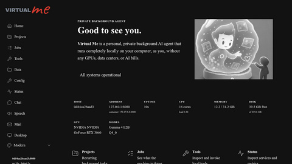
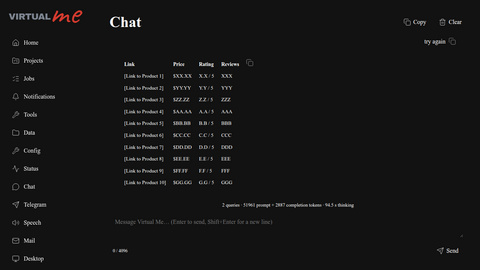
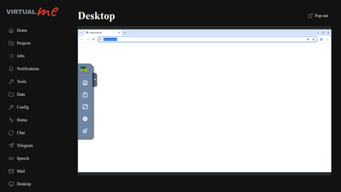

# Virtual Me

[Documentation](https://mayanklahiri.github.io/virtualme/)

<table>
<tr>
<td valign="top">

**Private Personal Background Agent**

[](https://github.com/mayanklahiri/virtualme/actions/workflows/ci.yml)
[](https://github.com/mayanklahiri/virtualme/actions/workflows/release.yml)
[](https://www.npmjs.com/package/virtualme)
[](https://hub.docker.com/r/mayanklahiri/virtualme)
[](https://hub.docker.com/r/mayanklahiri/virtualme)
[](LICENSE)

</td>
<td valign="top">

Your own AI assistant that browses the web for you, on your machine, on your schedule. Give it recurring tasks in plain English and watch it work in a real browser you can take over any time. Everything it sees, types, and remembers stays on your hardware.

Runs on a workstation, Raspberry Pi, or remote host. **No AI bills.** No GPU required. Your data never leaves your machine.
</td>
</tr>
</table>

<table>
<tr>
<td valign="top" align="center">

<!-- update-doc-images:home-route --><!-- /update-doc-images:home-route -->

**Your hardware. No cloud. No GPU required.**

</td>
<td valign="top" align="center">

<!-- update-doc-images:chat --><!-- /update-doc-images:chat -->

**Chat that drives a real browser.**

</td>
<td valign="top" align="center">

<!-- update-doc-images:desktop --><!-- /update-doc-images:desktop -->

**Watch and use the private browser live.**

</td>
</tr>
</table>

- **Open source** — free forever.
- **Fully local models** — no accounts, no API keys, no prices, no limits; free forever.
- **Full local browser use** — the agent drives a real Chromium on your machine, not a cloud session.
- **Total data locality** — no cloud service; chat, browser profiles, and projects never leave your computer.
- **All in one container, one port** — the whole stack ships as a single Docker image on port 8080.

Not frontier intelligence, but free forever.

## Quick start

```console
npx virtualme doctor   # check node >= 22 + docker
npx virtualme start    # pull + run the container
# open http://localhost:8080
```

Prefer the `virtualme` CLI. Equivalent Docker with a data directory:

```console
docker run -d --name virtualme -p 8080:8080 \
  -v ~/.virtualme:/home/virtualme/.virtualme \
  mayanklahiri/virtualme:latest
```

First start loads a ~4 GB model; give `/healthz` a few minutes to go green.

> No authentication or TLS yet. Run only on a trusted computer on a private network.

## User's Guide

### Where everything lives

| Artifact | Location |
|---|---|
| npm package | [`virtualme`](https://www.npmjs.com/package/virtualme) |
| Docker image | [`mayanklahiri/virtualme`](https://hub.docker.com/r/mayanklahiri/virtualme) |
| Source | [GitHub](https://github.com/mayanklahiri/virtualme) |
| Documentation | [mayanklahiri.github.io/virtualme](https://mayanklahiri.github.io/virtualme/) |
| Published releases | [GitHub Releases](https://github.com/mayanklahiri/virtualme/releases) |
| CI | [Workflow runs](https://github.com/mayanklahiri/virtualme/actions/workflows/ci.yml) · [source](.github/workflows/ci.yml) |
| Release automation | [Workflow runs](https://github.com/mayanklahiri/virtualme/actions/workflows/release.yml) · [source](.github/workflows/release.yml) |
| Design contracts | [`specs/`](specs/) |

### CLI commands

| Command | Effect |
|---|---|
| `virtualme help` | Show usage and every command |
| `virtualme version` | Print the package version |
| `virtualme doctor` | Check Node, Docker, daemon access, hooks, CPU, and RAM |
| `virtualme start [--data <dir>] [--no-browser-sandbox] [--gpus <spec>] [--no-gpu] [--rebuild]` | Run unprivileged with port 8080 and the data dir mounted rw; a detected host NVIDIA stack is passed through automatically (`--no-gpu` opts out, explicit `--gpus <spec>` overrides); optionally force Chromium's sandbox fallback; `--rebuild` builds the image, stops any running container, then starts |
| `virtualme stop` | Stop and remove the container; the data directory survives |
| `virtualme status` | Show container state and service health |
| `virtualme logs [-f\|--follow]` | Show or follow container logs |
| `virtualme build` | Build `:dev` and the configured start tag from a checkout |
| `virtualme keygen` | Generate a 256-bit base64url token |
| `virtualme update` | Pull the configured image tag |
| `virtualme soak [--no-build]` | Rebuild once, run the full e2e suite, then run live soak flows on a fresh data dir (source checkout only) |
| `./cli.sh docs dev [--host <host>] [--port <port>]` | Serve the documentation site from a source checkout |
| `./cli.sh docs build` | Build and verify the static documentation site from a source checkout |

Set `VIRTUALME_IMAGE` or `VIRTUALME_TAG` to override the default image reference,
`VIRTUALME_DATA` to override the default data directory, and `TZ` to override
the detected host timezone passed into the container. `start` also forwards
the `VM_MAIL_*` variables documented below plus `VM_TTS_CACHE_DIR` and
`VM_TTS_CACHE_MAX_MB`.

### Data directory

The host directory `~/.virtualme` (override with `--data <dir>` or
`VIRTUALME_DATA`) is created on first `start` and mounted read-write at the
container's `~/.virtualme`. It contains `valkey/` (chat and speech history,
stats, the reliable job queue, activity ledger, and project records),
`chromium/` (browser profile), `xdg/{config,cache,data}/`, `metrics/` (tiered
history), `agent/` (agent artifacts and manual `dom-dumps/` development
captures), `projects/` (per-project scratch space),
`tts-cache/` (recomputable synthesized audio), and `mail/` (dma config/spool,
bounded flush log, flush marker, and the DKIM private key). Chromium settings,
projects, and queued mail survive container and image replacement. The
container runs as the invoking host uid/gid, so
every data file is host-owned. Everything else is intentionally ephemeral or
baked into the image; the canonical persistence map is
[`specs/007-persistence-locality.md` §1](specs/007-persistence-locality.md#1-canonical-persistence-map),
as superseded for mail by [`spec 010 §7`](specs/010-outbound-mail.md#7-persistence--gate-updates-supersedes-spec-007-lists).

### Ports

| Address | Purpose |
|---|---|
| `8080` (exposed) | Controller SPA, health API, websocket state, and desktop proxy |
| `5900` (internal) | x11vnc |
| `6080` (internal) | noVNC/websockify |
| `6379` (internal) | Valkey |
| `8081` (internal) | llama-server |
| `8082` (internal, loopback only) | Local sherpa-onnx/Piper TTS daemon |
| `9222` (internal, loopback only) | Chromium DevTools observation endpoint |
| Xvfb display `:99` | Virtual desktop |

### Controller endpoints

| Route | Purpose |
|---|---|
| `/` | Console home: host and reachable/container addresses, live health/capacity, build version, model, and links |
| `/projects` | Recurring natural-language tasks, schedules, manual runs, and recent results |
| `/projects/<id>` | Project task, schedule, status, run history, and scratch-directory details |
| `/jobs` | Queue, filterable machine activity with durations, and type-specific details in three panes |
| `/tools` | Authoritative agent-tool list plus manual-only development tools (`dump_dom`), schema-generated forms, queue-backed manual invocation, and structured result rendering |
| `/data` | Read-only icon/list explorer of `$VM_DATA_DIR` with sortable size summaries, deep links, a resizable preview pane, and typed viewers |
| `/status` | Service health, system/GPU meters, LLM token/throughput and browser-action charts, active time selectors, Quick Options (jiggler and scheduler pause), and persistent per-process/GPU metrics |
| `/chat` | Markdown chat, generation controls, LLM progress, and conversation totals |
| `/speech` | Single-voice streaming local speech with seeds, persistent history/replay, and disk cache |
| `/mail` | Outbound-mail composer, durable outbox with per-message status, queue contents/errors/next-flush timing, queue clearing, and DKIM DNS record |
| `/desktop-view` | Embedded private noVNC desktop |
| `/healthz` | Aggregate JSON health for all eight services |
| `/ws` | Websocket: live state, metrics, queued jobs, activity, tool manifests/invocation, chat, agent, TTS, and mail frames |
| `POST /v1/audio/speech` | OpenAI-compatible local speech API (`wav` or raw `pcm`) |
| `GET /api/data/list` | Read-only directory listing under `$VM_DATA_DIR` (path-contained; trust model) |
| `GET /api/data/file` | Read-only file stream under `$VM_DATA_DIR` (text capped at 256 KiB unless `download=1`) |
| `GET /api/data/du` | Recursive sizes of immediate child directories, cached in Valkey for five minutes |
| `/desktop/` | Redirect to the noVNC client; child paths reverse-proxy noVNC and websockify |

History-API routes without file extensions fall back to the embedded SPA; missing asset paths still return 404. Status charts offer synchronized `15m` through `30d` lookbacks, boundary-aligned locale-aware time ticks, responsive titles and controls, and theme-consistent series colors; every chart downsamples client-side to at most 36 bars, CPU load and memory plus GPU utilization and memory (in GB) draw side by side, and dedicated charts track LLM tokens in/out, effective token throughput, and browser actions by category. The Status top banner carries overall health, the server-local scheduler clock with active selector tokens, and uptime. The branded console has eight themes, each with light and dark variants plus automatic system-scheme selection; the collapsed theme button is in the sidebar footer. Its home page shows hostname, the browser-reachable address, up to two container-interface addresses, uptime, CPU/load, memory, disk capacity, build version, and a detected GPU beside a theme-tinted logo hero image.

The sidebar connection watch shows the controller hostname and port beside a
status pip that is green when live, red while reconnecting, and muted while
connecting. The text below reports server uptime and the current browser
connection duration. Reduced-motion mode disables pulsing without removing the
color-coded state.

The Status-page Quick Options panel is a row of fixed-size cockpit-style
illuminated buttons with uppercase labels beneath and tooltips on
hover/focus (tap a label on touch). The default-on JIGGLER button moves the
virtual desktop's OS cursor in short humanlike bursts every 8 to 27 seconds,
yields only while the agent holds the input-actuation lock, and records each
burst in Jobs activity. The SCHED button is lit while scheduled-job promotion
runs; pressing it pauses promotion without touching interactive work. Both
states persist in Valkey across reloads and container restarts.

GPU detection is best-effort and multi-vendor. The Status card reports the
first visible NVIDIA, AMD, or Intel GPU and available model/VRAM (in GB)/driver
parameters. NVIDIA and supported AMD sysfs devices also expose utilization and
memory history; presence-only devices do not show an empty chart. GPU absence
is normal and never affects health. NVIDIA passthrough is automatic when
`start` detects `nvidia-smi` or Docker's `nvidia` runtime; use `--no-gpu` to
opt out. AMD/Intel `/dev/dri` passthrough is host-specific and outside the
CLI's `--gpus` option.

Closing Chromium in `/desktop-view` automatically brings back one blank tab. Chromium uses its namespace sandbox when the host permits unprivileged user namespaces; otherwise it falls back to `--no-sandbox` with the warning infobar suppressed. Use `--no-browser-sandbox` to force that fallback when diagnosing host compatibility.

### Browser agent

Messages in `/chat` can ask Virtual Me to operate Chromium. The local model can
observe a screenshot (gridded for its vision only), compact rendered DOM, page
URL/title/text, and system information. Precise CSS extraction, multi-assertion validation,
side-effect-guarded page evaluation, and layout/occlusion debugging provide
additional read-only CDP observations; it acts through `xdotool` OS
mouse/keyboard input or a bounded bash tool. CDP is method-allowlisted and
never performs input or navigation.
The console shows each tool step and its screenshot; Stop cancels the active
model call or tool process.
The agent estimates prompt size before every model call, supersedes stale
observations, compacts older tool results, and adapts the reply allowance to
the remaining default 32768-token context (up to one quarter). If generation
reaches that limit, the reply ends with
`…[response truncated at token limit]`.

Use `/tools` to inspect all model-callable tools plus manual-only development
tools such as `dump_dom`, and invoke them manually. Forms are generated from
the server schemas, calls join the same sequential queue as chat/project work,
and results up to 64 KiB enter the Jobs activity ledger. Results render by
shape: page-shaped JSON becomes a linked title plus plain text, `KEY=value`
runs become sorted tables, manual screenshots omit the agent's coordinate
grid, and `read_page` YAML renders as a collapsible tree. At the default model
context, model-facing `read_page` YAML is capped at 24576 bytes (the cap scales
with context), treats layout tables as containers so links survive, and
groups numbered feeds into explicit article fields including a ready-to-copy
linked title, score, comments, and comment URL. Real data tables retain
structured links. This can invoke `bash` and browser actuation;
under the current trust model it has no additional authentication, so expose the
console only on a trusted private network.

Use `/data` to browse the persistent volume without `docker exec`. Its
full-height explorer provides icon and list views, sortable columns, recursive
size bars, clickable breadcrumbs, `?path=` deep links, a remembered resizable
preview pane, and a full-screen mobile preview. Typed viewers handle image
lightboxes, JSON/YAML trees, JSONL rows, WAV playback, and capped text; every
file has a raw download. The root UI omits internal `chromium`, `mail`,
`metrics`, `valkey`, and `xdg` directories, but direct deep links and the
strictly path-contained read-only API expose the whole volume by design under
the current trust model.

All LLM work runs through a Valkey-backed sequential queue with interactive
priority, retries, visibility recovery, and a dead-letter list. Chat messages
wait instead of returning a busy error. Closing the initiating browser tab
cancels its running generation immediately and drops its queued jobs. The CLI
passes the host `TZ` into the container so time-bucket scheduling uses the
host's local wall clock.

### Projects

Use `/projects` to create recurring agent tasks in plain language. Each project
has a coarse day/time selector, an Enabled switch, a manual Run now action, and
five recent run summaries. Scheduled runs persist through Valkey and execute
sequentially with chat work. A manual run is tied to its initiating browser tab
and is cancelled if that tab closes; scheduled runs are not.

Project scratch files live under `~/.virtualme/projects/<id>/`. Deleting a
project removes its record and run summaries but deliberately preserves that
directory and its operator data.

### Jobs

Use `/jobs` to see what the machine is actually doing. The queue card groups
rows into Running now (at most one; only that row pulses), Up next, and
Recently finished, each row led by a short type-derived name, kind pill, and an
explicit status icon (check, error, or spinner). The newest-first activity
ledger records each LLM generation, agent tool call, speech synthesis, and
mail submission with its run time; selecting a row opens its payload, result,
timing, and type-specific details in a third pane at desktop widths. Tool
calls and jiggler bursts are hidden by default behind persisted filter
toggles. The bounded ledger persists in Valkey across container restarts.

### Local speech

The `/speech` tab streams sentence-level audio from the fully local
[sherpa-onnx](https://github.com/k2-fsa/sherpa-onnx) engine with the baked
Piper Lessac (en-US) voice. Seed texts (including a Sci-fi AI medley of famous
fictional computer lines) fill the editor, and the global newest-first history
persists in Valkey with cached replay. The browser starts playing after the
first sentence while later sentences synthesize. Agent chat can use the
`speak` tool when asked for an audible response; its audio bubble supports
replay.

OpenAI-compatible clients can call `POST /v1/audio/speech`; `wav` is the
default response format and `pcm` returns raw 16-bit mono PCM. Any `voice`
value other than `en_US-lessac-medium` falls back to Lessac. Exact
sentence/voice/speed renders are cached under `~/.virtualme/tts-cache/`;
`VM_TTS_CACHE_MAX_MB` sets the LRU cap (default 256 MiB), and deleting the
cache is safe.

### Outbound mail

The `/mail` tab submits standards-compliant multipart mail through the
unprivileged [dma](https://github.com/corecode/dma) queue. Messages can include
a generated inline CID image. Delivery is direct to recipient MX hosts by
default, or through a configured STARTTLS smarthost. Optional controller-side
DKIM signing exposes the DNS TXT name and value to publish in the status panel.
Expandable queue rows show the envelope recipient, subject, age, plain-text
preview, attachment types/sizes, newest recorded delivery error, and a live
countdown to the next queue flush; a confirmed Clear queue control removes all
spooled mail. The countdown is not a delivery guarantee: dma may apply its own
retry backoff. A durable Valkey outbox tracks each submission as queued, left
queue (dma cannot distinguish delivered from bounced), error, or cleared.

| Environment | Purpose |
|---|---|
| `VM_MAIL_MAILNAME` | HELO/default From domain; defaults to the container hostname |
| `VM_MAIL_FROM` | Envelope/header From; defaults to `virtualme@<mailname>` |
| `VM_MAIL_SMARTHOST` | Relay hostname; unset selects direct MX delivery |
| `VM_MAIL_SMARTHOST_PORT` | Relay port; defaults to `587` |
| `VM_MAIL_SMARTHOST_USER` | Optional relay username |
| `VM_MAIL_SMARTHOST_PASS` | Optional relay password |
| `VM_MAIL_DKIM_DOMAIN` | Enable DKIM signing for this domain |
| `VM_MAIL_DKIM_SELECTOR` | DKIM selector; defaults to `virtualme` |
| `VM_MAIL_FLUSH_SEC` | Queue flush cadence and countdown interval; defaults to `60` |

Set these variables before `virtualme start`; the CLI forwards them to the
container. Direct delivery needs SPF and/or DKIM alignment plus acceptable IP
and PTR reputation. Residential/dynamic IP mail is usually rejected, including
by Gmail, so use a reputable smarthost for reliable delivery.

Task screenshots and JSONL step logs are retained under
`~/.virtualme/agent/<taskId>/` for the most recent 20 tasks. CPU-only vision can
take tens of seconds per step. With NVIDIA passthrough (automatic detection,
explicit `--gpus <spec>`, or `VM_LLAMA_GPU=1`), the container's pinned Vulkan
llama.cpp build runs the model fully offloaded to the GPU; without it, the
CPU build is used. On startup the llama service logs its enumerated devices
(`svc-llama: ... Vulkan0: ...`); an empty list means the Vulkan driver failed
to initialize and inference is running on the CPU.

### AI skills

| Skill | Path | Use |
|---|---|---|
| `operate` | [`.cursor/skills/operate/SKILL.md`](.cursor/skills/operate/SKILL.md) | Install, run, and troubleshoot |
| `develop` | [`.cursor/skills/develop/SKILL.md`](.cursor/skills/develop/SKILL.md) | Follow contribution rules and patterns |
| `do-release` | [`.cursor/skills/do-release/SKILL.md`](.cursor/skills/do-release/SKILL.md) | Execute the full npm and Docker release |
| `master-update` | [`.cursor/skills/master-update/SKILL.md`](.cursor/skills/master-update/SKILL.md) | Audit docs against the tree; refresh `docs/src/screenshots/` from live `:8080` and rewire README image markers |

Claude Code discovers these through the `.claude/skills` symlink; Codex reads [`AGENTS.md`](AGENTS.md).

After changing anything structural, run the `/master-update` skill — it re-syncs this README, AGENTS.md, and all skills against the repo.

### Specifications

| Spec | Purpose |
|---|---|
| [001](specs/001-constitution.md) | Constitution, CLI, gates, CI/CD, and docs |
| [002](specs/002-container.md) | Docker image and controller stub |
| [003](specs/003-controller.md) | Controller, UI, assets, and end-to-end tests |
| [004](specs/004-release-hardening.md) | Immutable release versions, registry pre-checks, and GitHub Releases |
| [005](specs/005-console-ui.md) | Multi-page console, tiered metrics, themes, markdown chat, and LLM status |
| [006](specs/006-desktop-reliability.md) | Reliable Chromium supervision, sandbox fallback, and profile persistence |
| [007](specs/007-persistence-locality.md) | Persistence grounding and deterministic LLM-locality gate |
| [008](specs/008-browser-agent.md) | OS-level browser-control agent |
| [009](specs/009-local-tts.md) | Local sherpa-onnx/Piper speech synthesis |
| [010](specs/010-outbound-mail.md) | Outbound dma queue, MIME/DKIM, and Mail console |
| [011](specs/011-ui-refresh.md) | Console brand, collapsed theme picker, eight themes, and live-capacity home page |
| [012](specs/012-agent-observation-soak.md) | Dense DOM observations, settled navigation, desktop coverage, Playwright-layer removal, and the live soak suite |
| [013](specs/013-job-queue-scheduler.md) | Valkey job queue, time-bucket scheduler, and initiator-bound cancellation |
| [014](specs/014-projects.md) | Projects: periodic natural-language tasks with schedules and scratch dirs |
| [015](specs/015-jobs-page.md) | Jobs page: activity ledger and queue peek with details pane |
| [016](specs/016-chromium-determinism.md) | Chromium determinism flags and single full-screen window |
| [017](specs/017-jiggler.md) | Jiggler: humanlike OS-level mouse motion with a Status switch |
| [018](specs/018-gpu-observability.md) | Multi-vendor GPU detection, status widget, and usage series |
| [019](specs/019-chart-overhaul.md) | Chart ticks, titles, lookback control, and uniform series color |
| [020](specs/020-speech-audio.md) | Speech seeds/history, TTS disk cache, and audio hygiene |
| [021](specs/021-agent-cdp-tools-console.md) | CDP observation tools and the Tools console page |
| [022](specs/022-system-prompt.md) | On-disk embedded system prompts and SLM-optimized rewrite |
| [023](specs/023-mail-transparency.md) | Mail queue transparency: contents, errors, and retry timing |
| [024](specs/024-brand-chrome-polish.md) | Brand wordmark, wristwatch live indicator, and console polish |
| [025](specs/025-release-presentation.md) | Marvin release notes, registry metadata, and the /do-release skill |
| [026](specs/026-console-fixes.md) | Console bugfix sweep: chat, speech, charts, jobs, mail, tools, screenshots |
| [027](specs/027-structured-read-page.md) | Structured YAML `read_page` digest, tree UI, and tool-testing soak |
| [028](specs/028-data-explorer.md) | Read-only Data explorer tab and `/api/data/*` volume API |
| [029](specs/029-readpage-goldens.md) | `read_page` DOM goldens, layout-table fidelity, 32K context, and proportionate caps |
| [030](specs/030-docs-site.md) | Static Astro documentation/marketing site, shared themes, local docs CLI, and orphan-branch Pages publication |
| [031](specs/031-master-config.md) | Accepted configuration schema/exporter follow-up; not yet implemented |
| [032](specs/032-assistant-notifications.md) | Accepted durable assistant-notifications follow-up; not yet implemented |
| [033](specs/033-telegram.md) | Accepted authorized Telegram integration follow-up; not yet implemented |
| [034](specs/034-agent-context-budget.md) | Preflight agent context budgeting, scaled observations, adaptive completions, and graduated recovery |

### CI/CD

| Workflow | Trigger | Purpose and secrets |
|---|---|---|
| [CI](https://github.com/mayanklahiri/virtualme/actions/workflows/ci.yml) ([source](.github/workflows/ci.yml)) | Push to `main`; pull request | Node 22/24 gates, container smoke test, and the CLI-driven E2E test (including the restart cycle and chat probe); no secrets |
| [Release](https://github.com/mayanklahiri/virtualme/actions/workflows/release.yml) ([source](.github/workflows/release.yml)) | Tag `v*` | Registry immutability and committed-notes pre-checks; native amd64/arm64 Docker publishing; Docker Hub overview refresh; npm publishing; curated GitHub Release notes plus generated commits; `DOCKERHUB_USERNAME`, `DOCKERHUB_TOKEN`, `NPM_TOKEN` |
| [Docs](https://github.com/mayanklahiri/virtualme/actions/workflows/docs.yml) ([source](.github/workflows/docs.yml)) | Docs-related pull requests and pushes to `main` | Builds and browser-tests with read permission; main pushes rebuild and publish branch-root output to the orphan `docs` branch with write permission |

### Development setup

```console
git clone https://github.com/mayanklahiri/virtualme.git
cd virtualme
npm install
npm ci --prefix docs
git config core.hooksPath .githooks
bash controller/tools/fetch-assets.sh
npm run check
./cli.sh build
./cli.sh start
```

`npm run check` builds the minified SPA (`controller/web/dist/`, gitignored),
checks generated shared-theme outputs, and builds the isolated docs package
offline before the Go gates. Run `npm run build:web` to rebuild the SPA alone,
or `./cli.sh docs dev` / `./cli.sh docs build` for the site. Astro and
Playwright remain exact-pinned only in `docs/package.json`; browser setup is
explicit: `npm --prefix docs exec playwright install chromium`.

The eight controller/docs themes are authored once in
`common/themes/themes.json` and checked through
`scripts/generate-themes.mjs --check`. Site analytics is disabled by default;
its sole edit point is `docs/src/config/site.ts`.

After the docs workflow first publishes, configure GitHub Pages once to deploy
from branch `docs`, folder `/ (root)`. The production URL is
<https://mayanklahiri.github.io/virtualme/>.

Offline `read_page` golden tests discover `test/fixtures/*.dom.json`, execute
the production extractor, evaluate optional `*.props.mjs` assertions, and
byte-compare `*.digest.golden.yaml` snapshots. Set `REGEN_GOLDENS=1` to
refresh snapshots. To capture a live fixture, navigate the running browser and
run `node test/capture-dom.mjs <fixture-name>` against a healthy `:8080`.

### Release runbook

Requires the spec 002+ container scaffold, including `docker/Dockerfile`. Run
the `/do-release` skill for the full preflight, version, notes, commit, tag,
push, monitoring, and verification procedure.

Every tag requires a committed, non-empty `release-notes/vX.Y.Z.md`. The
release workflow verifies that the version is unused and the notes exist,
builds amd64 and arm64 images on native runners, merges the multi-arch
manifest, refreshes the Docker Hub overview from `docker/DOCKERHUB.md`,
publishes npm, and creates a GitHub Release with the curated notes followed by
the generated commit list.

`DOCKERHUB_TOKEN` must be a Docker Hub password or PAT with repository write
scope. A read-only token makes the overview PATCH fail with HTTP 403 and fails
the release job.

Version tags are write-once on Docker Hub (`X.Y.Z`, `X.Y.Z-amd64`, and `X.Y.Z-arm64`) and npm (`X.Y.Z`); only Docker's `latest` tag moves. If an attempt fails after publishing any versioned artifact, re-run the failed jobs in that same Actions run or fix the problem, bump the patch version, and create a new tag. Never delete and re-push a release tag: even an orphaned per-architecture Docker tag permanently retires that version number.

### Hardware

Use a Raspberry Pi 5 or Raspberry Pi 4 with 8 GB RAM at minimum. The RAM floor is 8 GB; Gemma 4 E2B Q4_0 is approximately 3 GB on disk and 4 GB resident.

## Architecture

The container has s6-supervised Xvfb, openbox, x11vnc, noVNC, Chromium, Valkey, vision-enabled llama.cpp with Gemma 4 E2B and a default 32768-token context (baked CPU and Vulkan GPU runtimes; the service picks one at startup), local sherpa-onnx/Piper TTS, a dma outbound-mail queue, and a Go controller on `:8080`, running unprivileged (host uid/gid) with one rw data mount. The controller concurrently probes service health, detects and samples visible NVIDIA/AMD/Intel GPUs, samples and persists metrics, records machine activity, composes and DKIM-signs mail, schedules and sequentially executes reliable Valkey jobs and recurring projects, streams shared chat and speech, produces default-on ambient OS-level mouse motion, and runs a bounded browser-agent loop combining screenshots, compact DOM/read-only CDP observations, OS-level `xdotool` actions, bash, and audible responses. It proxies noVNC and embeds the same-origin minified multi-page SPA. See [`specs/`](specs/) for the authoritative architecture and implementation contracts.

The model's system prompts are plain text in
[controller/prompts/](controller/prompts/) (spec 022).
