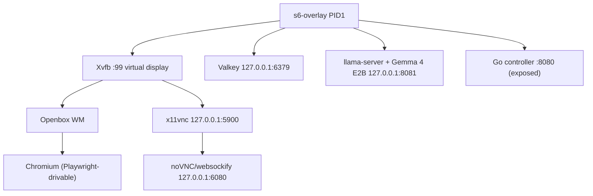

# Spec 002: Layered Docker Container

| | |
|---|---|
| Status | Approved for execution |
| Depends on | `specs/001-constitution.md` executed (repo scaffolded, gates green) |
| Produces | `docker/` (Dockerfile, numbered layer scripts, s6 service tree), stub Go controller with `/healthz`, `test/smoke.sh`, `.dockerignore` |
| Followed by | `specs/003-controller.md` |

## 0. Executor instructions

- The constitution in `specs/001-constitution.md` section 1 binds this spec. Rules 6 (append-only numbered layers) and 7 (pinned artifacts) are the core of this document.
- Stop-on-red: verify each section before continuing; finish with the Acceptance Checklist (section 10).
- All pinned URLs and sha256 values below were verified against the live sources on 2026-07-22. **Before use, re-verify each sha256 by downloading and hashing** (`curl -fsSL <url> | sha256sum`). If a hash does not match, STOP and report — do not substitute a different artifact silently.
- There is no auth/TLS (constitution rule 8: trusted private network, prototype), but the container is **not** run as root: everything runs as the unprivileged `virtualme` user (uid/gid 1000 by default, overridden at run time with `--user` to match the host user — see section 4a). The root filesystem is mounted read-write (a `--read-only` mount proved too restrictive: s6-overlay creates rc.d files at runtime), but the running uid cannot write root-owned paths anyway; persistent state goes to the single rw data mount at `/home/virtualme/.virtualme`, scratch to tmpfs (`/run`, `/tmp`).
- A full build downloads ~3.2 GB (model + runtime). Expect the first build to take several minutes; subsequent builds hit the Docker layer cache.

## 1. What this container is

One Docker image, `mayanklahiri/virtualme`, containing the entire Virtual Me universe supervised by s6-overlay (PID 1):



| Port | Service | Binding |
|---|---|---|
| 8080 | Go controller (`/healthz`, later SPA/ws/proxy) | `0.0.0.0`, **only EXPOSEd port** |
| 6080 | noVNC (websockify web client) | 127.0.0.1 |
| 5900 | x11vnc | 127.0.0.1 |
| 6379 | Valkey | 127.0.0.1 |
| 8081 | llama-server (OpenAI-compatible API + `/health`) | 127.0.0.1 |
| `:99` | Xvfb X display (unix socket only, `-nolisten tcp`) | — |

Hardware target: Raspberry Pi 5 or Pi 4 (8 GB). RAM floor 8 GB (model ≈ 2.9 GB on disk, ~4 GB resident).

Runtime security posture (grounded against the s6-overlay v3 README, "Read-Only Root Filesystem" and `USER` sections, and the linuxserver.io non-root guidance, 2026-07): s6-overlay supports running the whole supervision tree as a non-root user provided `S6_READ_ONLY_ROOT=1` is set (the non-root uid cannot write root-owned paths such as `/etc`, so s6 must stage its work area on tmpfs) and `/run` is a tmpfs mounted `exec` and owned by the container uid. The root filesystem is **not** mounted read-only — an earlier `--read-only` posture was reverted as too restrictive. The canonical invocation (produced by `virtualme start`, spec 001 §5) is:

```
docker run -d --name virtualme --restart unless-stopped --shm-size=1g \
  --user "<uid>:<gid>" \
  --tmpfs /run:exec,mode=755,uid=<uid>,gid=<gid> \
  --tmpfs /tmp:mode=1777 \
  -p 8080:8080 \
  -v <DATA_DIR>:/home/virtualme/.virtualme \
  mayanklahiri/virtualme:latest
```

`<uid>:<gid>` are the invoking host user's, so every file the container writes into the data mount is owned by the host user. `/tmp` is a tmpfs because Xvfb creates `/tmp/.X11-unix` (mode 1777) and services use it for scratch. All persistent state lives under the data mount.

## 2. Pinned artifacts (constitution rule 7)

| Artifact | URL | sha256 |
|---|---|---|
| Model: Gemma 4 E2B instruct, Q4_0 GGUF (2,900 MiB) | `https://huggingface.co/unsloth/gemma-4-E2B-it-GGUF/resolve/main/gemma-4-E2B-it-Q4_0.gguf` | `31d3a3c630d4e71a7416498c42660dd3805066948acaec76a47e1ffac7010132` |
| llama.cpp `b10091` linux amd64 | `https://github.com/ggml-org/llama.cpp/releases/download/b10091/llama-b10091-bin-ubuntu-x64.tar.gz` | `d52fa1542d0aba5f2f7dbd86cf694f80db8d1c0bb1874b6d2ad15bebaa0efc6c` |
| llama.cpp `b10091` linux arm64 | `https://github.com/ggml-org/llama.cpp/releases/download/b10091/llama-b10091-bin-ubuntu-arm64.tar.gz` | `f4167a723abeee0c58e1ed5c0f6c58380cceece9e969878bb5833855a5e042d5` |
| s6-overlay `v3.2.3.2` noarch | `https://github.com/just-containers/s6-overlay/releases/download/v3.2.3.2/s6-overlay-noarch.tar.xz` | `5379750ed30a84bbd2e2dd74847ba6b5bd29cd0b2e3ea2ec58049b57eb2eda12` |
| s6-overlay `v3.2.3.2` x86_64 | `.../v3.2.3.2/s6-overlay-x86_64.tar.xz` | `e6befcc96a437a3831386ecfc51808c5d3e939dc5fe3c02ae9284599e8aa2408` |
| s6-overlay `v3.2.3.2` aarch64 | `.../v3.2.3.2/s6-overlay-aarch64.tar.xz` | `b17f17a82e7a515c682a91edaf2ffdabb73f891981b6c1fd712115693a2f8b4c` |

Debian trixie (`debian:stable-slim`) packages used, verified present: `xvfb` (src xorg-server 21.1.16), `openbox` 3.6.1, `x11vnc` 0.9.17, `novnc` 1.6.0, `websockify` 0.12.0, `chromium` 150.x, `valkey-server` 8.1.1, `xdotool`, `x11-utils`, `nodejs` 20.19, `npm`.

Model choice rationale (grounded 2026-07): Gemma 4 (released 2026-04) is Google's current open family; E2B is the edge-device variant; Q4_0 is the QAT-friendly quant; the unsloth GGUF mirror is ungated (no `HF_TOKEN` build secret needed). It is baked into a low image layer per this project's design: images are large (~5 GB) but fully self-contained and offline-capable.

## 3. Layer architecture (constitution rule 6)

Numbered scripts in `docker/layers/`, one `COPY`+`RUN` pair each in the Dockerfile, **slowest-moving at the bottom**. New capability = new higher number appended at the end. Editing an existing layer requires an `## Amendments` entry in this spec.

| # | Script | Contents | Why this position |
|---|---|---|---|
| 001 | `001-base.sh` | apt update/upgrade, ca-certificates, curl, xz-utils, procps | OS base: changes ~never |
| 002 | `002-llama-runtime.sh` | libgomp/libcurl deps + pinned llama.cpp prebuilt → `/opt/llama` | pinned release; rare bumps |
| 003 | `003-model.sh` | pinned Gemma GGUF → `/opt/models` | 2.9 GB — keep low so upper changes never re-download |
| 004 | `004-xvfb-desktop.sh` | xvfb, openbox, x11vnc, novnc, websockify, dbus-x11, xdotool, x11-utils | stable desktop stack |
| 005 | `005-chromium.sh` | chromium, fonts-liberation | tracks Debian security updates |
| 006 | `006-valkey.sh` | valkey-server | stable |
| 007 | `007-node-playwright.sh` | nodejs, npm, pinned `playwright-core` in `/opt/agent` | npm pin bumps occasionally |
| 008 | `008-s6-overlay.sh` | pinned s6-overlay tarballs extracted to `/` | stable |
| 009 | `009-user.sh` | unprivileged `virtualme` user (uid/gid 1000) + home | stable |
| top | `COPY docker/rootfs/ /` + controller binary | service definitions, config | changes most often |

All layer scripts: mode 755, `#!/usr/bin/env bash`, `set -euo pipefail`, `export DEBIAN_FRONTEND=noninteractive` when using apt, `rm -rf /var/lib/apt/lists/*` after apt installs, safe to re-run (idempotent).

### `docker/layers/001-base.sh`

```bash
#!/usr/bin/env bash
# Layer 001: OS base. Slowest-moving layer; edit only via spec amendment.
set -euo pipefail
export DEBIAN_FRONTEND=noninteractive
apt-get update
apt-get upgrade -y
apt-get install -y --no-install-recommends \
  ca-certificates curl xz-utils procps
rm -rf /var/lib/apt/lists/*
```

### `docker/layers/002-llama-runtime.sh`

```bash
#!/usr/bin/env bash
# Layer 002: llama.cpp prebuilt CPU runtime, pinned release.
set -euo pipefail
export DEBIAN_FRONTEND=noninteractive

LLAMA_TAG="b10091"
case "$(uname -m)" in
  x86_64)
    ASSET="llama-${LLAMA_TAG}-bin-ubuntu-x64.tar.gz"
    SHA256="d52fa1542d0aba5f2f7dbd86cf694f80db8d1c0bb1874b6d2ad15bebaa0efc6c"
    ;;
  aarch64)
    ASSET="llama-${LLAMA_TAG}-bin-ubuntu-arm64.tar.gz"
    SHA256="f4167a723abeee0c58e1ed5c0f6c58380cceece9e969878bb5833855a5e042d5"
    ;;
  *) echo "unsupported arch: $(uname -m)" >&2; exit 1 ;;
esac

apt-get update
CURL_PKG=libcurl4
if apt-cache show libcurl4t64 >/dev/null 2>&1; then CURL_PKG=libcurl4t64; fi
apt-get install -y --no-install-recommends libgomp1 "$CURL_PKG"
rm -rf /var/lib/apt/lists/*

cd /tmp
curl -fsSL --retry 3 -o "$ASSET" \
  "https://github.com/ggml-org/llama.cpp/releases/download/${LLAMA_TAG}/${ASSET}"
echo "${SHA256}  ${ASSET}" | sha256sum -c -
mkdir -p /opt/llama
tar -xzf "$ASSET" --strip-components=1 -C /opt/llama
rm -f "$ASSET"

# Sanity gate: prebuilt must run on this libc/arch. If this fails, STOP and
# use the source-build fallback documented in specs/002-container.md §3.1.
LD_LIBRARY_PATH=/opt/llama /opt/llama/llama-server --version
```

#### 3.1 Source-build fallback (only if the sanity gate fails)

If `llama-server --version` fails (e.g. glibc mismatch on a future base image), replace the download block of `002-llama-runtime.sh` with a source build **in the same layer script**, record it as an amendment, and keep the same sanity gate:

```bash
apt-get install -y --no-install-recommends build-essential cmake git libcurl4-openssl-dev
git clone --depth 1 --branch "$LLAMA_TAG" https://github.com/ggml-org/llama.cpp /tmp/llama-src
cmake -S /tmp/llama-src -B /tmp/llama-build -DGGML_NATIVE=OFF -DGGML_CUDA=OFF -DBUILD_SHARED_LIBS=ON
cmake --build /tmp/llama-build --config Release -j "$(nproc)" --target llama-server
# install llama-server + lib*.so* to /opt/llama, then purge build deps and sources
```

GPU support is explicitly out of scope now; the design leaves room for a future `NNN-gpu-runtime.sh` layer appended on top (constitution rule 6).

### `docker/layers/003-model.sh`

```bash
#!/usr/bin/env bash
# Layer 003: Gemma 4 E2B instruct GGUF (Q4_0), baked into the image.
# Grounded 2026-07: current Google open-model family, edge variant, ungated mirror.
set -euo pipefail

MODEL_URL="https://huggingface.co/unsloth/gemma-4-E2B-it-GGUF/resolve/main/gemma-4-E2B-it-Q4_0.gguf"
MODEL_SHA256="31d3a3c630d4e71a7416498c42660dd3805066948acaec76a47e1ffac7010132"
MODEL_PATH="/opt/models/gemma-4-E2B-it-Q4_0.gguf"

mkdir -p /opt/models
curl -fSL --retry 3 -o "$MODEL_PATH" "$MODEL_URL"
echo "${MODEL_SHA256}  ${MODEL_PATH}" | sha256sum -c -
chmod 0444 "$MODEL_PATH"
```

### `docker/layers/004-xvfb-desktop.sh`

```bash
#!/usr/bin/env bash
# Layer 004: virtual display + window manager + VNC + noVNC + X tooling.
set -euo pipefail
export DEBIAN_FRONTEND=noninteractive
apt-get update
apt-get install -y --no-install-recommends \
  xvfb openbox x11vnc novnc websockify dbus-x11 xdotool x11-utils
rm -rf /var/lib/apt/lists/*
```

### `docker/layers/005-chromium.sh`

```bash
#!/usr/bin/env bash
# Layer 005: Chromium from Debian (no snap; sandbox disabled at runtime in-container).
set -euo pipefail
export DEBIAN_FRONTEND=noninteractive
apt-get update
apt-get install -y --no-install-recommends chromium fonts-liberation
rm -rf /var/lib/apt/lists/*
```

### `docker/layers/006-valkey.sh`

```bash
#!/usr/bin/env bash
# Layer 006: Valkey (Debian's Redis-compatible fork).
set -euo pipefail
export DEBIAN_FRONTEND=noninteractive
apt-get update
apt-get install -y --no-install-recommends valkey-server
rm -rf /var/lib/apt/lists/*
```

### `docker/layers/007-node-playwright.sh`

```bash
#!/usr/bin/env bash
# Layer 007: Node.js + playwright-core for driving the system Chromium.
# PLAYWRIGHT_VERSION is exact-pinned; bump only via spec amendment.
set -euo pipefail
export DEBIAN_FRONTEND=noninteractive

PLAYWRIGHT_VERSION="<pin>"   # executor: `npm view playwright-core version`, hardcode result

apt-get update
apt-get install -y --no-install-recommends nodejs npm
rm -rf /var/lib/apt/lists/*

mkdir -p /opt/agent
cd /opt/agent
npm init -y >/dev/null
npm install --save-exact "playwright-core@${PLAYWRIGHT_VERSION}"
node -e "require('playwright-core'); console.log('playwright-core ok')"
```

Note for future agent specs: launch with `chromium.launch({ executablePath: "/usr/bin/chromium", args: ["--no-sandbox"] })` or connect to the already-running supervised Chromium via CDP. `playwright-core` never downloads browsers, so no browser blobs enter the image.

### `docker/layers/008-s6-overlay.sh`

```bash
#!/usr/bin/env bash
# Layer 008: s6-overlay (PID 1 process supervisor), pinned.
set -euo pipefail

S6_VERSION="v3.2.3.2"
BASE_URL="https://github.com/just-containers/s6-overlay/releases/download/${S6_VERSION}"
NOARCH_SHA256="5379750ed30a84bbd2e2dd74847ba6b5bd29cd0b2e3ea2ec58049b57eb2eda12"
case "$(uname -m)" in
  x86_64)
    ARCH_ASSET="s6-overlay-x86_64.tar.xz"
    ARCH_SHA256="e6befcc96a437a3831386ecfc51808c5d3e939dc5fe3c02ae9284599e8aa2408"
    ;;
  aarch64)
    ARCH_ASSET="s6-overlay-aarch64.tar.xz"
    ARCH_SHA256="b17f17a82e7a515c682a91edaf2ffdabb73f891981b6c1fd712115693a2f8b4c"
    ;;
  *) echo "unsupported arch: $(uname -m)" >&2; exit 1 ;;
esac

cd /tmp
curl -fsSL --retry 3 -O "${BASE_URL}/s6-overlay-noarch.tar.xz"
curl -fsSL --retry 3 -O "${BASE_URL}/${ARCH_ASSET}"
echo "${NOARCH_SHA256}  s6-overlay-noarch.tar.xz" | sha256sum -c -
echo "${ARCH_SHA256}  ${ARCH_ASSET}" | sha256sum -c -
tar -C / -Jxpf s6-overlay-noarch.tar.xz
tar -C / -Jxpf "${ARCH_ASSET}"
rm -f s6-overlay-noarch.tar.xz "${ARCH_ASSET}"
```

### `docker/layers/009-user.sh`

```bash
#!/usr/bin/env bash
# Layer 009: unprivileged runtime user. The CLI overrides uid/gid at run time
# with --user to match the host user; this account provides the default
# identity, the home path, and the data mountpoint parent.
set -euo pipefail
groupadd --gid 1000 virtualme
useradd --uid 1000 --gid 1000 --create-home --shell /usr/sbin/nologin virtualme
```

The image never writes to `/home/virtualme` at run time (it is owned by uid 1000 in the image, but the container runs as the host uid); all writable state lives on the tmpfs mounts and the rw data mount at `/home/virtualme/.virtualme`.

## 4. Dockerfile

**`docker/Dockerfile`** — exact contents. The controller build stage tolerates the pre-003 stub (no `tools/fetch-assets.sh` / `scripts/build-web.sh` yet); once spec 003 exists it fetches pinned fonts, installs the exact-pinned toolchain from the committed lockfile (`npm ci` — integrity-hash pinned, constitution rule 7), and minifies the SPA before the Go build embeds it.

```dockerfile
# syntax=docker/dockerfile:1
FROM golang:1.26-trixie AS controller-build
WORKDIR /src
COPY package.json package-lock.json ./
COPY scripts/build-web.sh scripts/build-web.sh
COPY controller/ controller/
RUN if [ -f controller/tools/fetch-assets.sh ]; then \
      apt-get update && apt-get install -y --no-install-recommends unzip nodejs npm \
      && bash controller/tools/fetch-assets.sh; \
    fi
RUN if [ -f scripts/build-web.sh ]; then npm ci && bash scripts/build-web.sh; fi
RUN cd controller && CGO_ENABLED=0 go build -trimpath -ldflags="-s -w" -o /out/controller ./cmd/controller

FROM debian:stable-slim

LABEL org.opencontainers.image.title="Virtual Me" \
      org.opencontainers.image.description="Private personal background agent: Xvfb, Chromium, Playwright, Valkey, llama.cpp + Gemma, Go control plane" \
      org.opencontainers.image.source="https://github.com/mayanklahiri/virtualme" \
      org.opencontainers.image.licenses="MIT"

# Append-only layer sequence (constitution rule 6): slowest-moving first.
# Each script is COPY'd individually so editing layer N only rebuilds N and above.
COPY docker/layers/001-base.sh /tmp/layers/001-base.sh
RUN bash /tmp/layers/001-base.sh
COPY docker/layers/002-llama-runtime.sh /tmp/layers/002-llama-runtime.sh
RUN bash /tmp/layers/002-llama-runtime.sh
COPY docker/layers/003-model.sh /tmp/layers/003-model.sh
RUN bash /tmp/layers/003-model.sh
COPY docker/layers/004-xvfb-desktop.sh /tmp/layers/004-xvfb-desktop.sh
RUN bash /tmp/layers/004-xvfb-desktop.sh
COPY docker/layers/005-chromium.sh /tmp/layers/005-chromium.sh
RUN bash /tmp/layers/005-chromium.sh
COPY docker/layers/006-valkey.sh /tmp/layers/006-valkey.sh
RUN bash /tmp/layers/006-valkey.sh
COPY docker/layers/007-node-playwright.sh /tmp/layers/007-node-playwright.sh
RUN bash /tmp/layers/007-node-playwright.sh
COPY docker/layers/008-s6-overlay.sh /tmp/layers/008-s6-overlay.sh
RUN bash /tmp/layers/008-s6-overlay.sh
COPY docker/layers/009-user.sh /tmp/layers/009-user.sh
RUN bash /tmp/layers/009-user.sh

# Fast-moving top: service tree + controller binary.
COPY docker/rootfs/ /
COPY --from=controller-build /out/controller /usr/local/bin/controller

ENV LANG=C.UTF-8 \
    HOME=/home/virtualme \
    VM_DATA_DIR=/home/virtualme/.virtualme \
    XDG_CONFIG_HOME=/home/virtualme/.virtualme/xdg/config \
    XDG_CACHE_HOME=/home/virtualme/.virtualme/xdg/cache \
    XDG_DATA_HOME=/home/virtualme/.virtualme/xdg/data \
    VM_DISPLAY=:99 \
    VM_RESOLUTION=1600x900x24 \
    VM_MODEL_PATH=/opt/models/gemma-4-E2B-it-Q4_0.gguf \
    VM_LLAMA_PORT=8081 \
    VM_LLAMA_CTX=4096 \
    VM_HTTP_ADDR=:8080 \
    S6_READ_ONLY_ROOT=1 \
    S6_BEHAVIOUR_IF_STAGE2_FAILS=2 \
    S6_CMD_WAIT_FOR_SERVICES_MAXTIME=0

USER virtualme
EXPOSE 8080
ENTRYPOINT ["/init"]
```

No `VOLUME` instruction: the data directory is a **required bind mount** supplied by `virtualme start` (spec 001 §5), not an anonymous volume.

**`.dockerignore`** (repo root)

```
*
!controller
!docker
!package.json
!package-lock.json
!scripts/build-web.sh
```

### Environment variable contract

| Var | Default | Meaning |
|---|---|---|
| `VM_DATA_DIR` | `/home/virtualme/.virtualme` | the single rw mount; all persistent state lives here |
| `HOME` | `/home/virtualme` | home of the runtime user; data mount is `$HOME/.virtualme` |
| `XDG_CONFIG_HOME` / `XDG_CACHE_HOME` / `XDG_DATA_HOME` | `$VM_DATA_DIR/xdg/{config,cache,data}` | redirect app dotfiles into the data mount (root-owned paths are not writable by the runtime uid) |
| `VM_DISPLAY` | `:99` | X display for Xvfb/Chromium/xdotool |
| `VM_RESOLUTION` | `1600x900x24` | Xvfb screen geometry |
| `VM_MODEL_PATH` | `/opt/models/gemma-4-E2B-it-Q4_0.gguf` | GGUF served by llama-server |
| `VM_LLAMA_PORT` | `8081` | llama-server port (localhost) |
| `VM_LLAMA_CTX` | `4096` | llama-server context size |
| `VM_THREADS` | `$(nproc)` | llama-server CPU threads |
| `VM_HTTP_ADDR` | `:8080` | controller listen address |
| `S6_READ_ONLY_ROOT` | `1` | s6-overlay stages its work area on the `/run` tmpfs; required because the runtime uid cannot write root-owned `/etc` (kept even though the root fs mounts rw) |

## 5. s6 service tree (`docker/rootfs/`)

s6-overlay v3 with s6-rc service definitions. Structure:

```
docker/rootfs/etc/
├── cont-init.d/
│   └── 10-data-dirs.sh
├── s6-overlay/user-bundles.d/
│   └── user/{type,contents.d/{svc-xvfb,svc-openbox,svc-x11vnc,svc-novnc,svc-valkey,svc-llama,svc-chromium,svc-controller}}
│       (type contains `bundle`; the 8 contents.d entries are empty files.
│        REQUIRED location: if `s6-rc.d/user` exists, s6-overlay's rc.init
│        unconditionally rewrites its type file at boot, which fails because
│        the non-root runtime uid cannot write root-owned /etc — user bundles
│        must live in user-bundles.d.)
└── s6-overlay/s6-rc.d/
    ├── svc-xvfb/{type,run,dependencies.d/base}
    ├── svc-openbox/{type,run,dependencies.d/base,dependencies.d/svc-xvfb}
    ├── svc-x11vnc/{type,run,dependencies.d/base,dependencies.d/svc-xvfb}
    ├── svc-novnc/{type,run,dependencies.d/base,dependencies.d/svc-x11vnc}
    ├── svc-valkey/{type,run,dependencies.d/base}
    ├── svc-llama/{type,run,dependencies.d/base}
    ├── svc-chromium/{type,run,dependencies.d/base,dependencies.d/svc-openbox}
    └── svc-controller/{type,run,dependencies.d/base}
```

Every service `type` file contains exactly `longrun`. Every `dependencies.d/*` is an empty file. Every `run` file is mode 755. Exact contents:

**`etc/cont-init.d/10-data-dirs.sh`** (mode 755)

Creates the per-service directories inside the data mount and clears Chromium's
process-local singleton files, which can survive container replacement on the
persistent data dir and would otherwise make Chromium reject the profile.
(The `with-contenv` shebang is required: legacy cont-init scripts do NOT
receive the container environment otherwise, so `$VM_DATA_DIR` would be
unset.)

```bash
#!/command/with-contenv bash
set -euo pipefail
mkdir -p "$VM_DATA_DIR/valkey" "$VM_DATA_DIR/chromium" \
  "$VM_DATA_DIR/xdg/config" "$VM_DATA_DIR/xdg/cache" "$VM_DATA_DIR/xdg/data"
rm -f "$VM_DATA_DIR/chromium/SingletonCookie" \
  "$VM_DATA_DIR/chromium/SingletonLock" \
  "$VM_DATA_DIR/chromium/SingletonSocket"
```

**`svc-xvfb/run`**

```bash
#!/command/with-contenv bash
exec Xvfb "$VM_DISPLAY" -screen 0 "$VM_RESOLUTION" -ac -noreset -nolisten tcp
```

**`svc-openbox/run`**

```bash
#!/command/with-contenv bash
export DISPLAY="$VM_DISPLAY"
until xdpyinfo >/dev/null 2>&1; do sleep 0.2; done
exec openbox
```

**`svc-x11vnc/run`** — `-noxdamage -noxfixes` are required: the X DAMAGE extension crashes x11vnc against Xvfb (grounded, known issue).

```bash
#!/command/with-contenv bash
export DISPLAY="$VM_DISPLAY"
until xdpyinfo >/dev/null 2>&1; do sleep 0.2; done
exec x11vnc -display "$VM_DISPLAY" -forever -shared -nopw -localhost \
  -rfbport 5900 -noxdamage -noxfixes -quiet
```

**`svc-novnc/run`**

```bash
#!/command/with-contenv bash
exec websockify --web=/usr/share/novnc 127.0.0.1:6080 127.0.0.1:5900
```

**`svc-valkey/run`** — append-only persistence on the data mount so state (e.g. the chat history from spec 003) survives container replacement.

```bash
#!/command/with-contenv bash
exec valkey-server --bind 127.0.0.1 --port 6379 --save "" --appendonly yes --dir "$VM_DATA_DIR/valkey"
```

**`svc-llama/run`**

```bash
#!/command/with-contenv bash
export LD_LIBRARY_PATH=/opt/llama
exec /opt/llama/llama-server \
  --model "$VM_MODEL_PATH" \
  --host 127.0.0.1 --port "$VM_LLAMA_PORT" \
  --ctx-size "$VM_LLAMA_CTX" \
  --threads "${VM_THREADS:-$(nproc)}" \
  --no-webui
```

**`svc-chromium/run`** — `--no-sandbox` is required (no setuid sandbox helper available to the unprivileged user in a container); profile persists on the data mount.

```bash
#!/command/with-contenv bash
export DISPLAY="$VM_DISPLAY"
until xdpyinfo >/dev/null 2>&1; do sleep 0.2; done
exec chromium --no-sandbox --disable-gpu --no-first-run \
  --disable-session-crashed-bubble --user-data-dir="$VM_DATA_DIR/chromium" \
  --start-maximized about:blank
```

**`svc-controller/run`**

```bash
#!/command/with-contenv bash
exec /usr/local/bin/controller
```

Notes: s6 restarts any service that dies; the `until xdpyinfo` loops just avoid noisy crash-restart cycles while Xvfb boots. `S6_CMD_WAIT_FOR_SERVICES_MAXTIME=0` means container start does not block on service readiness — readiness is the controller's `/healthz` job.

## 6. Stub Go controller

Spec 003 replaces this with the full control plane; the stub exists so this spec is independently testable and the Dockerfile's builder stage is real. Health-probe semantics defined here are permanent.

**`controller/go.mod`**

```
module github.com/mayanklahiri/virtualme/controller

go 1.26
```

**`controller/cmd/controller/main.go`** — exact contents (must be `gofmt`-clean; `scripts/check.sh` now runs the Go gates automatically because `controller/` exists):

```go
// Command controller is the Virtual Me master orchestrator.
// Spec 002 scope: aggregate health endpoint only. Spec 003 adds the SPA,
// websocket state channel, and noVNC reverse proxy.
package main

import (
	"encoding/json"
	"fmt"
	"net"
	"net/http"
	"os"
	"os/exec"
	"strings"
	"time"
)

// Service is the probe result for one supervised internal service.
type Service struct {
	Name   string `json:"name"`
	OK     bool   `json:"ok"`
	Detail string `json:"detail,omitempty"`
}

// Health is the aggregate health report served at /healthz.
type Health struct {
	OK       bool      `json:"ok"`
	Services []Service `json:"services"`
}

const probeTimeout = 2 * time.Second

func env(key, def string) string {
	if v := os.Getenv(key); v != "" {
		return v
	}
	return def
}

func checkX11Socket(display string) Service {
	path := "/tmp/.X11-unix/X" + strings.TrimPrefix(display, ":")
	if _, err := os.Stat(path); err != nil {
		return Service{Name: "xvfb", Detail: err.Error()}
	}
	return Service{Name: "xvfb", OK: true}
}

func checkTCP(name, addr string) Service {
	c, err := net.DialTimeout("tcp", addr, probeTimeout)
	if err != nil {
		return Service{Name: name, Detail: err.Error()}
	}
	_ = c.Close()
	return Service{Name: name, OK: true}
}

func checkHTTP(name, url string) Service {
	client := &http.Client{Timeout: probeTimeout}
	resp, err := client.Get(url)
	if err != nil {
		return Service{Name: name, Detail: err.Error()}
	}
	defer resp.Body.Close()
	if resp.StatusCode < 200 || resp.StatusCode > 299 {
		return Service{Name: name, Detail: fmt.Sprintf("status %d", resp.StatusCode)}
	}
	return Service{Name: name, OK: true}
}

func checkValkey(addr string) Service {
	c, err := net.DialTimeout("tcp", addr, probeTimeout)
	if err != nil {
		return Service{Name: "valkey", Detail: err.Error()}
	}
	defer c.Close()
	_ = c.SetDeadline(time.Now().Add(probeTimeout))
	if _, err := c.Write([]byte("PING\r\n")); err != nil {
		return Service{Name: "valkey", Detail: err.Error()}
	}
	buf := make([]byte, 16)
	n, err := c.Read(buf)
	if err != nil || !strings.HasPrefix(string(buf[:n]), "+PONG") {
		return Service{Name: "valkey", Detail: "no +PONG"}
	}
	return Service{Name: "valkey", OK: true}
}

func checkChromium(display string) Service {
	cmd := exec.Command("xdotool", "search", "--onlyvisible", "--class", "chromium")
	cmd.Env = append(os.Environ(), "DISPLAY="+display)
	if err := cmd.Run(); err != nil {
		return Service{Name: "chromium", Detail: "no visible window"}
	}
	return Service{Name: "chromium", OK: true}
}

func gather() Health {
	display := env("VM_DISPLAY", ":99")
	llamaPort := env("VM_LLAMA_PORT", "8081")
	services := []Service{
		checkX11Socket(display),
		checkTCP("x11vnc", "127.0.0.1:5900"),
		checkHTTP("novnc", "http://127.0.0.1:6080/vnc.html"),
		checkValkey("127.0.0.1:6379"),
		checkHTTP("llama", "http://127.0.0.1:"+llamaPort+"/health"),
		checkChromium(display),
	}
	h := Health{OK: true, Services: services}
	for _, s := range services {
		if !s.OK {
			h.OK = false
		}
	}
	return h
}

func main() {
	mux := http.NewServeMux()
	mux.HandleFunc("/healthz", func(w http.ResponseWriter, _ *http.Request) {
		h := gather()
		w.Header().Set("Content-Type", "application/json")
		if !h.OK {
			w.WriteHeader(http.StatusServiceUnavailable)
		}
		_ = json.NewEncoder(w).Encode(h)
	})
	mux.HandleFunc("/", func(w http.ResponseWriter, _ *http.Request) {
		fmt.Fprintln(w, "virtualme controller stub (spec 002); SPA arrives in spec 003")
	})
	addr := env("VM_HTTP_ADDR", ":8080")
	fmt.Println("controller listening on", addr)
	if err := http.ListenAndServe(addr, mux); err != nil {
		fmt.Fprintln(os.Stderr, err)
		os.Exit(1)
	}
}
```

Health semantics (permanent contract): `/healthz` returns HTTP 200 with `"ok":true` iff **all six** probes pass (xvfb socket, x11vnc TCP, noVNC `vnc.html`, valkey `PING`→`+PONG`, llama `/health`, visible Chromium window via xdotool); otherwise HTTP 503 with per-service details.

## 7. Smoke test

**`test/smoke.sh`** (mode 755) — build, boot, wait for all-green health, verify a visible browser. Runs locally and in the CI `container` job (the guard step from spec 001's `ci.yml` activates automatically once this file exists).

```bash
#!/usr/bin/env bash
# Container smoke test: build image, boot with the production runtime posture
# (non-root user matching the invoking uid/gid, tmpfs /run and /tmp, single rw
# data mount), poll /healthz until all-green, verify a visible
# Chromium window on the Xvfb display and host-owned data files.
set -euo pipefail
cd "$(dirname "${BASH_SOURCE[0]}")/.."

IMAGE_TAG="virtualme:smoke"
NAME="virtualme-smoke"
PORT="${SMOKE_PORT:-18080}"
TIMEOUT="${SMOKE_TIMEOUT:-300}"
DATA_DIR="$(mktemp -d)"

fail() {
  echo "smoke: FAIL: $*" >&2
  echo "--- container logs (tail) ---" >&2
  docker logs "$NAME" 2>&1 | tail -200 >&2 || true
  docker rm -f "$NAME" >/dev/null 2>&1 || true
  rm -rf "$DATA_DIR"
  exit 1
}

echo "smoke: building image"
docker build -f docker/Dockerfile -t "$IMAGE_TAG" . || { echo "smoke: FAIL: build" >&2; exit 1; }

docker rm -f "$NAME" >/dev/null 2>&1 || true
echo "smoke: starting container (uid $(id -u))"
docker run -d --name "$NAME" --shm-size=1g \
  --user "$(id -u):$(id -g)" \
  --tmpfs "/run:exec,mode=755,uid=$(id -u),gid=$(id -g)" \
  --tmpfs /tmp:mode=1777 \
  -p "${PORT}:8080" \
  -v "${DATA_DIR}:/home/virtualme/.virtualme" \
  "$IMAGE_TAG" >/dev/null

echo "smoke: waiting for all-green /healthz (timeout ${TIMEOUT}s)"
deadline=$(( $(date +%s) + TIMEOUT ))
until curl -fsS "http://127.0.0.1:${PORT}/healthz" 2>/dev/null | grep -q '"ok":true'; do
  if [ "$(date +%s)" -ge "$deadline" ]; then
    fail "healthz not green within ${TIMEOUT}s: $(curl -s "http://127.0.0.1:${PORT}/healthz" || echo unreachable)"
  fi
  sleep 5
done

echo "smoke: checking for visible chromium window"
docker exec -e DISPLAY=:99 "$NAME" xdotool search --onlyvisible --class chromium >/dev/null \
  || fail "no visible chromium window on :99"

echo "smoke: checking data dir is populated and host-owned"
[ -d "$DATA_DIR/valkey" ] || fail "data dir missing valkey/"
[ "$(stat -c %u "$DATA_DIR/valkey")" = "$(id -u)" ] || fail "data files not owned by host user"

echo "smoke: checking container runs unprivileged"
[ "$(docker exec "$NAME" id -u)" = "$(id -u)" ] || fail "container not running as host uid"

docker rm -f "$NAME" >/dev/null
rm -rf "$DATA_DIR"
echo "smoke: OK"
```

CI note: GitHub `ubuntu-24.04` runners (public repos: 4 vCPU / 16 GB) handle the 2.9 GB model download and ~4 GB resident load; the 300 s health timeout covers model load. If the model download makes CI flaky, raise `SMOKE_TIMEOUT` via workflow `env` — do not weaken the health criteria.

## 8. CLI integration check

No CLI code changes are needed (spec 001 already defines `build`, `start` with the data-dir/user contract, and `status`). Verify `node bin/virtualme.js build` works from the repo root, `node bin/virtualme.js start` runs that local image with the canonical invocation from section 1 (creating `~/.virtualme` on first use), and `node bin/virtualme.js status` reports per-service health.

## 9. Docs refresh (constitution rule 9)

Run the `/master-update` skill procedure (`.cursor/skills/master-update/SKILL.md`). Expected changes it must produce:

- README User's Guide: port map now real; remove `*(available after spec 002)*` markers for container features; add "first start loads a ~3 GB model — allow a few minutes" note; hardware floor already documented.
- `develop` skill: layer table matches `docker/layers/`; s6 service list matches `docker/rootfs/`.
- `AGENTS.md`: commands table gains `bash test/smoke.sh`.

## 10. Acceptance checklist (run every item)

| # | Command / action | Expected |
|---|---|---|
| 1 | `npm run check` | `check: OK` (now includes shell-syntax gate over `docker/layers/*.sh` and the Go gates over the stub) |
| 2 | Every pinned sha256 in section 2 re-verified before build | matches; STOP on mismatch |
| 3 | `PLAYWRIGHT_VERSION` in `007-node-playwright.sh` | exact version, not `<pin>`/`latest` |
| 4 | `docker build -f docker/Dockerfile -t virtualme:dev .` | succeeds on amd64 |
| 5 | `docker history virtualme:dev` | one RUN layer per numbered script, model layer ≈ 2.9 GB, ordered as section 3 |
| 6 | `docker run --rm virtualme:dev sha256sum /opt/models/gemma-4-E2B-it-Q4_0.gguf` | `31d3a3c6...0132` |
| 7 | `bash test/smoke.sh` | `smoke: OK` — includes the host-uid and data-ownership checks |
| 8 | While smoke container runs: `curl -s http://127.0.0.1:18080/healthz` | JSON, `"ok":true`, six services all `"ok":true` |
| 9 | `docker exec virtualme-smoke curl -fsS http://127.0.0.1:6080/vnc.html` | HTML (noVNC reachable in-container only) |
| 10 | `docker exec virtualme-smoke sh -c 'LD_LIBRARY_PATH=/opt/llama /opt/llama/llama-server --version'` | prints version |
| 11 | Host port scan: only 18080 (mapped 8080) published | `docker port virtualme-smoke` shows a single mapping |
| 12 | `docker exec virtualme-smoke id -u` | the invoking host uid (not 0) |
| 13 | Data dir after smoke start | contains `valkey/`, `chromium/`, `xdg/`; every file owned by the invoking host user |
| 14 | CI: push branch, `container` job runs `test/smoke.sh` | green (skipped-message gone) |
| 15 | README/skills refreshed via `/master-update` | section 9 changes present |

Commit as `spec 002: layered container, baked Gemma 4 E2B, s6 services, stub controller, smoke test`.

## Amendments

### 2026-07-23 — home directory must be traversable by host uid

`useradd --create-home` creates `/home/virtualme` mode `0700`. The container
runs as the host uid/gid (often not 1000 — GitHub Actions runners use 1001),
so a non-matching uid cannot traverse into `$HOME` to reach the bind-mounted
`$VM_DATA_DIR`. Cont-init then fails with
`mkdir: cannot create directory '/home/virtualme': Permission denied` and s6
aborts before any service starts.

**Layer `009-user.sh` change** (constitution rule 6: editing an existing layer
requires this amendment): after `useradd`, make the home and data mountpoint
traversable and present in the image:

```bash
chmod 755 /home/virtualme
mkdir -p /home/virtualme/.virtualme
chown virtualme:virtualme /home/virtualme/.virtualme
chmod 755 /home/virtualme/.virtualme
```

No change to the run-time contract: persistent writes still go only to the
bind-mounted `$VM_DATA_DIR`; the home itself remains rootfs-owned and
non-writable by a non-1000 runtime uid.

### 2026-07-23 — Layer 007 (Node.js + playwright-core) removed by spec 012

Spec 008 implemented the browser agent with a raw read-only CDP client in the
Go controller; the Node/Playwright driver anticipated by §layer-007 was never
built, so the layer shipped dead weight (`npm`, `playwright-core`, and
`/opt/agent/node_modules`). Spec 012 deletes
`docker/layers/007-node-playwright.sh` and its `COPY`+`RUN` pair from the
Dockerfile. The layer numbering gap is permanent (layers are append-only;
008-015 keep their numbers). A bare `nodejs` binary remains as a transitive
dependency of the Debian `novnc` package (layer 004). `system-manifest.sh` no
longer uses `node` for JSON escaping (pure-bash escaper) and drops the `node`
tools entry; the image label no longer mentions Playwright.
