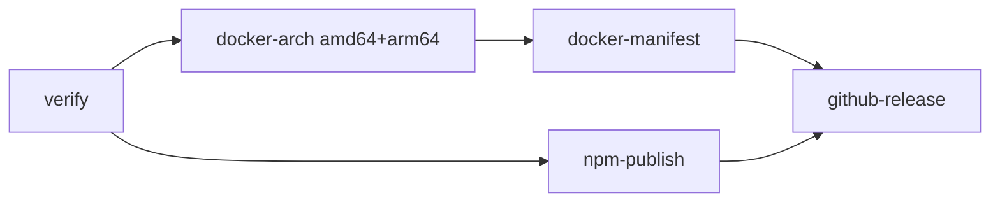

# Spec 004: Release Hardening — Immutable Versions and GitHub Releases

| | |
|---|---|
| Status | Executed (2026-07-22) |
| Depends on | `specs/001-constitution.md` executed (release workflow exists) |
| Produces | Hardened `.github/workflows/release.yml`: registry immutability pre-checks, explicit workflow permissions, GitHub Release creation with generated notes; README release-runbook update |
| Followed by | Independent of specs 005–008 (may execute in any order relative to them) |

## 0. Executor instructions

- The constitution (`specs/001-constitution.md` §1) binds this spec. This spec **supersedes the `release.yml` contents given in spec 001 §8** (constitution rule 4: prior specs are not edited; superseding text lives here). Everything else from spec 001 §8 — trigger, secrets, native arm64 runners, no QEMU — is unchanged.
- Secrets remain `DOCKERHUB_USERNAME`, `DOCKERHUB_TOKEN`, `NPM_TOKEN`. The repository owner provisions them; a secret named `DOCKER_HUB_TOKEN` (with underscore) is **not** referenced by any workflow.
- Stop-on-red per section; finish with the Acceptance Checklist (§5).
- Determinism note (constitution rule 5): the registry pre-checks in this spec use the network **inside the release workflow only**. `scripts/check.sh` gains nothing from this spec and stays network-free.

## 1. Immutability model

A released version is write-once across every distribution channel:

| Artifact | Tag/version | Mutability |
|---|---|---|
| git | `vX.Y.Z` | immutable by convention: never delete + re-push a tag; the pre-checks below make re-use fail anyway |
| Docker Hub `mayanklahiri/virtualme` | `X.Y.Z`, `X.Y.Z-amd64`, `X.Y.Z-arm64` | **immutable** — the workflow refuses to run if any already exists |
| Docker Hub `mayanklahiri/virtualme` | `latest` | mutable convenience tag, moves on every release |
| npm `virtualme` | `X.Y.Z` | **immutable** — pre-checked by the workflow; the npm registry additionally refuses republish of any previously published version (defense in depth) |

Policy consequences (state these in the README runbook, §4):

1. A release that failed partway is **not** retried under the same version by pushing the tag again. Fix the problem, bump the patch version, tag anew. (Re-running failed *jobs* of the same workflow run via the Actions UI is fine — that is the same attempt, same commit.)
2. Orphaned per-arch tags from an aborted attempt (e.g. `0.2.0-amd64` exists but `0.2.0` does not) permanently retire that version number: the pre-check treats any existing version tag as a hard stop.
3. `latest` is the only tag that ever moves.

## 2. `.github/workflows/release.yml` — exact new contents

Changes vs spec 001 §8: top-level `permissions: contents: read`; two new immutability pre-check steps in `verify`; new `github-release` job (with job-scoped `contents: write`) that runs only after both publish legs succeed. The `docker-arch`, `docker-manifest`, and `npm-publish` jobs are byte-identical to spec 001 §8.

```yaml
name: release

on:
  push:
    tags: ["v*"]

permissions:
  contents: read

env:
  IMAGE: mayanklahiri/virtualme

jobs:
  verify:
    runs-on: ubuntu-24.04
    steps:
      - uses: actions/checkout@v4
      - name: Tag matches package.json version
        run: |
          PKG=$(node -p "require('./package.json').version")
          [ "v$PKG" = "$GITHUB_REF_NAME" ] || { echo "tag $GITHUB_REF_NAME != package.json v$PKG"; exit 1; }
      - name: Immutability — version tags absent from Docker Hub
        run: |
          VERSION=${GITHUB_REF_NAME#v}
          for tag in "$VERSION" "$VERSION-amd64" "$VERSION-arm64"; do
            if docker manifest inspect "$IMAGE:$tag" >/dev/null 2>&1; then
              echo "refusing to release: $IMAGE:$tag already exists on Docker Hub" >&2
              exit 1
            fi
          done
      - name: Immutability — version absent from npm
        run: |
          VERSION=${GITHUB_REF_NAME#v}
          if [ -n "$(npm view "virtualme@$VERSION" version 2>/dev/null)" ]; then
            echo "refusing to release: virtualme@$VERSION already exists on npm" >&2
            exit 1
          fi

  docker-arch:
    needs: verify
    strategy:
      matrix:
        include:
          - runner: ubuntu-24.04
            arch: amd64
          - runner: ubuntu-24.04-arm
            arch: arm64
    runs-on: ${{ matrix.runner }}
    steps:
      - uses: actions/checkout@v4
      - uses: docker/login-action@v3
        with:
          username: ${{ secrets.DOCKERHUB_USERNAME }}
          password: ${{ secrets.DOCKERHUB_TOKEN }}
      - name: Build and push per-arch image
        run: |
          VERSION=${GITHUB_REF_NAME#v}
          docker build -f docker/Dockerfile -t "$IMAGE:$VERSION-${{ matrix.arch }}" .
          docker push "$IMAGE:$VERSION-${{ matrix.arch }}"

  docker-manifest:
    needs: docker-arch
    runs-on: ubuntu-24.04
    steps:
      - uses: docker/login-action@v3
        with:
          username: ${{ secrets.DOCKERHUB_USERNAME }}
          password: ${{ secrets.DOCKERHUB_TOKEN }}
      - name: Create multi-arch manifests
        run: |
          VERSION=${GITHUB_REF_NAME#v}
          docker buildx imagetools create -t "$IMAGE:$VERSION" -t "$IMAGE:latest" \
            "$IMAGE:$VERSION-amd64" "$IMAGE:$VERSION-arm64"

  npm-publish:
    needs: verify
    runs-on: ubuntu-24.04
    steps:
      - uses: actions/checkout@v4
      - uses: actions/setup-node@v4
        with:
          node-version: 24
          registry-url: https://registry.npmjs.org
      - run: npm ci
      - run: CHECK_SKIP_GO=1 npm run check
      - run: npm publish --access public
        env:
          NODE_AUTH_TOKEN: ${{ secrets.NPM_TOKEN }}

  github-release:
    needs: [docker-manifest, npm-publish]
    runs-on: ubuntu-24.04
    permissions:
      contents: write
    steps:
      - uses: actions/checkout@v4
      - name: Create GitHub Release with generated notes
        env:
          GH_TOKEN: ${{ github.token }}
        run: |
          gh release create "$GITHUB_REF_NAME" \
            --verify-tag \
            --title "$GITHUB_REF_NAME" \
            --generate-notes
```

Grounding notes:

- `docker manifest inspect` against a public repository needs no credentials and exits non-zero when the tag is absent — exactly the signal the pre-check needs. It runs before `docker/login-action`, deliberately: an anonymous 404 is the success path.
- `npm view virtualme@X.Y.Z version` prints nothing and exits non-zero for a nonexistent version; output is captured so a transient stderr warning cannot fake a hit.
- `gh` is preinstalled on GitHub-hosted runners and `github.token` with job-scoped `contents: write` is sufficient for `gh release create`. `--verify-tag` refuses to create a release for a tag that does not exist at the pushed commit; `gh release create` also fails if a release for the tag already exists, extending immutability to the Releases page.
- `github-release` runs only after **both** the Docker manifest and the npm publish succeed, so a Release entry implies all artifacts of that version are live.

## 3. Ordering and failure matrix



| Failure point | Published state afterwards | Recovery |
|---|---|---|
| `verify` (tag mismatch or version exists) | nothing published | fix, bump version, new tag |
| one `docker-arch` leg | at most one per-arch tag | re-run failed jobs (same attempt) or bump version |
| `docker-manifest` | per-arch tags only; `X.Y.Z`/`latest` untouched | re-run failed jobs or bump version |
| `npm-publish` | Docker side may be fully live; npm absent | re-run failed jobs (npm pre-check still passes — version was never published) |
| `github-release` | everything published, no Release page entry | re-run failed jobs; `gh release create` is the only action taken |

## 4. Docs refresh (constitution rule 9)

Run the `/master-update` skill procedure. Expected changes:

- README release runbook: add the immutability policy from §1 — version tags are write-once on Docker Hub and npm; a failed release attempt retires its version number (or is resumed via re-run-failed-jobs); only `latest` moves; releases now appear on the GitHub Releases page with autogenerated notes.
- README CI/CD table: `release` workflow row gains the `github-release` job and notes the pre-checks; required secrets unchanged (`DOCKERHUB_USERNAME`, `DOCKERHUB_TOKEN`, `NPM_TOKEN`).
- `develop` skill: no change expected (release process is README territory).

## 5. Acceptance checklist (run every item)

| # | Command / action | Expected |
|---|---|---|
| 1 | `python3 -c "import yaml; yaml.safe_load(open('.github/workflows/release.yml'))"` (or any YAML validator) | parses |
| 2 | `npm run check` | `check: OK` (workflow changes cannot affect the gate) |
| 3 | Local rehearsal of the Docker pre-check: `docker manifest inspect mayanklahiri/virtualme:0.0.0-nonexistent; echo $?` | non-zero (absent tag → pre-check would pass) |
| 4 | Local rehearsal against an existing tag: `docker manifest inspect mayanklahiri/virtualme:latest >/dev/null && echo exists` | `exists` (present tag → pre-check would block) |
| 5 | Local rehearsal of the npm pre-check: `npm view virtualme@0.0.0 version 2>/dev/null; echo $?` | empty output, non-zero |
| 6 | Diff `release.yml` against spec 001 §8 | only the changes named in §2: `permissions`, two `verify` steps, `github-release` job |
| 7 | Next real release (`git tag vX.Y.Z && git push --tags`) | all five jobs green; Docker Hub shows `X.Y.Z`, `X.Y.Z-amd64`, `X.Y.Z-arm64`, moved `latest`; npm shows `X.Y.Z`; GitHub Releases page shows `vX.Y.Z` with generated notes |
| 8 | Push the same tag name again (only if a throwaway version was used for 7) | `verify` fails on the Docker Hub pre-check; nothing overwritten |
| 9 | `/master-update` run | §4 changes present |

Commit as `spec 004: immutable release versions, registry pre-checks, GitHub Releases`.

## Amendments

### 2026-07-22 — Docker Hub rehearsal before the first published image

Acceptance item 4 is conditional on `mayanklahiri/virtualme:latest` already existing. At execution time Docker Hub returned `no such manifest`; this does not affect the release pre-check because absence is its success path. Items 7 and 8 remain production observations for the next real release and an optional throwaway-version replay, respectively.

### 2026-07-24 — Curated release notes

Spec 025 supersedes §2's `github-release` invocation. Releases now use the
committed `release-notes/vX.Y.Z.md`, then append GitHub's generated commit list
below it; the immutable tag and registry pre-checks remain unchanged.
