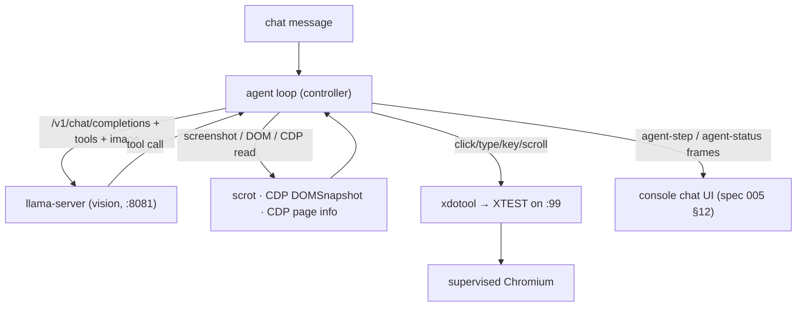

# Spec 008: OS-Level Browser-Control Agent

| | |
|---|---|
| Status | Executed (2026-07-23) |
| Depends on | `specs/002-container.md`, `specs/003-controller.md` executed; `specs/005-console-ui.md` (agent-step UI hooks, chat stop) and `specs/006-desktop-reliability.md` (stable Chromium) executed; complies with `specs/007-persistence-locality.md` (adds `agent/` to the map) |
| Produces | Controller agent loop with OS-level actuation (xdotool/XTEST) + screen capture + read-only CDP + rendered-DOM observation + bash + system-info tools; vision enablement (pinned mmproj + `--mmproj`); new capture/CDP docker layer; system manifest; CLI GPU passthrough; agent artifacts under the data mount; e2e coverage |
| Followed by | Future specs (grounding-tuned VLM swap, richer tool policy, auth) |

## 0. Executor instructions

- The constitution (`specs/001-constitution.md` §1) binds this spec. `controller/go.mod` must still have **zero `require` lines**: the agent loop, tool executors, JPEG/PNG handling (via `image/jpeg`, `image/png` from the Go stdlib), CDP client (JSON over the DevTools websocket, reusing `internal/ws` framing helpers or a minimal client), and DOM compaction are all in-repo or stdlib.
- New capabilities are added as **new higher-numbered docker layers** and new `docker/rootfs/` files (constitution rule 6): existing layers 001–009 are not edited. The vision projector is added as a new layer, not by editing layer 003.
- This spec **supersedes** one file from spec 002 §5 (`svc-llama/run` — adds `--mmproj`; note spec 005 §5d already added `--slots`, so the executor merges both changes) and one from spec 001 §5 / spec 006 §4 (`src/commands/start.js` — adds `--gpus`). Superseding text lives here.
- All pins in §3/§7 were fetched and hashed against live sources on 2026-07-22. **Re-verify each sha256 before build** (`curl -fsSL <url> | sha256sum`); STOP on mismatch.
- Trust model unchanged (constitution rule 8): trusted private network, single user; no domain allowlist. The container boundary + step cap + stop button are the controls.
- Latency expectation (documented, not a bug): CPU-only vision steps take tens of seconds each (image encode + generation on a 2B-class model). Acceptable for a background agent. GPU passthrough (§8) accelerates when available.
- Stop-on-red per section; finish with the Acceptance Checklist (§11).

## 1. What the agent is

A tool-use loop in the Go controller that lets the local model **operate the supervised Chromium as a human would**: it observes via screenshots (vision), the rendered DOM (JSON), and read-only CDP ground truth (URL/title/text), and it acts **only** through OS-level input (xdotool → XTEST) — mouse and keyboard on the real X display `:99`. No CDP-driven actions; CDP is observation-only. Every chat message may trigger the loop; plain questions are answered directly.



## 2. Observation and actuation model

- **Coordinate space**: screenshots are captured at the Xvfb resolution (`VM_RESOLUTION`, default 1600×900), downscaled to a fixed **API space** (max 1024 wide, aspect preserved) before being sent to the model, with a light labeled grid overlay (100-px-in-screen-space gridlines with coordinate labels) to aid the small model's spatial grounding. The controller keeps the scale factor and maps every model-supplied API-space coordinate back to screen space before calling xdotool. This mirrors the reference computer-use scaling approach.
- **Actuation**: all actions go through `xdotool` on `DISPLAY=:99` (XTEST): `mousemove`, `click`, `keydown/up`/`type`, `key` (chords), scroll (`click 4/5`). Never CDP `Input.*`.
- **DOM-referenced actuation (preferred for precision)**: the `dom` tool assigns each returned element a stable integer `ref`. `click_element`/`type_into` take a `ref`, look up that node's layout bounding box from the DOM snapshot, compute its center in screen space, and actuate **via xdotool**. Actions stay OS-level; only the coordinates come from the DOM rather than the model's visual estimate. Raw API-space coordinate actions remain available as a fallback.
- **Read-only CDP**: the controller connects to Chromium's DevTools endpoint on `127.0.0.1` (see §3 launch flag) for observation only: current URL, title, extracted visible text, and `DOMSnapshot`. It never issues input, navigation, or state-changing CDP commands. (Navigation is done by the agent typing into the address bar or the `navigate` tool driving the omnibox via xdotool, keeping the "human-like" model; a direct `Page.navigate` is explicitly excluded to honor the OS-level constraint.)

## 3. Chromium + llama changes

### 3a. Chromium remote-debugging (observation only)

Spec 006's `svc-chromium/run` canonical flag set gains (superseding merge with spec 006 §2):

```
--remote-debugging-port=9222 --remote-debugging-address=127.0.0.1
```

Localhost-only, consistent with the trust model (only 8080 is published). The controller reads `http://127.0.0.1:9222/json` to find the page target's websocket and speaks CDP for the read-only observations in §2.

### 3b. Vision projector (new layer, not an edit to 003)

New **`docker/layers/010-vision-projector.sh`** (appended after 009; slow-moving, ~940 MB — placed high enough that it re-downloads rarely but it is a large layer, documented):

```bash
#!/usr/bin/env bash
# Layer 010: multimodal projector (mmproj) for the baked Gemma 4 E2B model,
# enabling llama-server vision (screenshot understanding). Pinned.
set -euo pipefail

MMPROJ_URL="https://huggingface.co/unsloth/gemma-4-E2B-it-GGUF/resolve/main/mmproj-F16.gguf"
MMPROJ_SHA256="140be8d7849741f88c50757d529b84373ee8e27052cc2236855b537f4a8215fa"
MMPROJ_PATH="/opt/models/mmproj-gemma-4-E2B-F16.gguf"

mkdir -p /opt/models
curl -fSL --retry 3 -o "$MMPROJ_PATH" "$MMPROJ_URL"
echo "${MMPROJ_SHA256}  ${MMPROJ_PATH}" | sha256sum -c -
chmod 0444 "$MMPROJ_PATH"
```

Add the matching `COPY`+`RUN` pair at the end of the layer sequence in `docker/Dockerfile`, and a new env var `VM_MMPROJ_PATH=/opt/models/mmproj-gemma-4-E2B-F16.gguf` in the Dockerfile `ENV` block. (Model swap to a grounding-tuned VLM such as Qwen3-VL/Holo1.5 is **out of scope** — a future spec; the loop is written model-agnostically against the OpenAI-compatible image API.)

### 3c. Capture + CDP tooling (new layer)

New **`docker/layers/011-agent-tools.sh`** (appended after 010): installs `scrot` (screen capture) and `imagemagick` (downscale + grid overlay via `convert`); nothing else (xdotool/x11-utils already present from layer 004). Standard apt idempotent layer.

### 3d. `svc-llama/run` (superseding merge)

Final contents (spec 002 base + spec 005 §5d `--slots` + this spec's `--mmproj`):

```bash
#!/command/with-contenv bash
export LD_LIBRARY_PATH=/opt/llama
exec /opt/llama/llama-server \
  --model "$VM_MODEL_PATH" \
  --mmproj "$VM_MMPROJ_PATH" \
  --host 127.0.0.1 --port "$VM_LLAMA_PORT" \
  --ctx-size "$VM_LLAMA_CTX" \
  --threads "${VM_THREADS:-$(nproc)}" \
  --slots \
  --no-webui
```

`VM_LLAMA_CTX` is raised to `8192` in the Dockerfile ENV (image tokens plus DOM text need more context than 4096); documented as a superseding change to spec 002 §4.

## 4. `internal/agent` — the loop

```go
type Tool struct{ Name, Description string; Schema json.RawMessage }  // OpenAI-style function tool
type Agent struct{ /* llamaURL, cdp client, xdotool path, display, dataDir, broadcast, step cap */ }

func New(cfg Config, broadcast func([]byte)) *Agent
func (a *Agent) Handle(ctx context.Context, userText string) (finalReply string, err error)
```

- **Entry**: `chat.Service` routes every accepted user message through the agent. The system prompt (from the manifest, §6) advertises the tools (§5) and the operating rules (single trusted user, be concise, prefer DOM refs for clicks, stop when the task is done and answer the user). The model may answer directly (no tool calls) — that is the plain-chat path, streamed exactly as spec 003/005 chat.
- **Loop**: request `POST /v1/chat/completions` with `tools`, `stream:true`; when the model emits a tool call, execute it (§5), append the tool result (and, for observation tools, the resulting image/DOM as the next user turn's content), broadcast an `agent-step` frame, and continue. Assistant prose between/after tool calls streams as normal `chat-delta`. On a final assistant message with no tool call, finish: persist as the assistant reply (`chat-done`), broadcast terminal `agent-status`.
- **Step cap**: default 25 tool calls per user task (`VM_AGENT_MAX_STEPS`). On reaching the cap, stop and emit an assistant message explaining the cap was hit + `agent-status phase:"failed"`.
- **Stop**: `chat-stop` (spec 005 §2) cancels the agent context: in-flight tool and llama call abort, a partial reply is finalized, `agent-status phase:"stopped"`.
- **Single-flight**: reuses the existing chat busy flag (one task at a time).
- **Status**: emits `agent-status` (`planning` before a model call, `acting` during a tool, `observing` after an observation tool, terminal `done|failed|stopped`) into the same UI subtext slot as `llm-status` (spec 005 §12).

## 5. Tools

All tool executors run as the unprivileged `virtualme` uid inside the container; the container is the sandbox (trust model).

| Tool | Args | Effect |
|---|---|---|
| `screenshot` | — | `scrot` the display → downscale to API space + grid overlay (`convert`) → return JPEG (as image content on the next model turn) + the scale factor. |
| `dom` | `selectorHint?` (string), `page?` (int) | CDP `DOMSnapshot.captureSnapshot` → compacted-but-complete JSON (§5a). Paginated when large. |
| `read_page` | — | CDP read-only: `{url, title, text}` (visible text, truncated to a byte cap). |
| `click` | `x`, `y` (API space) | map to screen, `xdotool mousemove click 1`. |
| `click_element` | `ref` (int) | resolve DOM node box center → screen → `xdotool` click. |
| `type` | `text` | `xdotool type` into the focused element. |
| `type_into` | `ref`, `text` | click the element (as above) then `xdotool type`. |
| `key` | `keys` (e.g. `ctrl+l`, `Return`) | `xdotool key`. |
| `scroll` | `dir` (`up`/`down`), `amount?` | `xdotool click 4/5` repeated. |
| `navigate` | `url` | focus the omnibox (`xdotool key ctrl+l`), `type` the URL, `key Return` — OS-level, not `Page.navigate`. |
| `bash` | `command` (string), `timeoutSec?` (≤ 300, default 60) | one-shot `bash -lc` as the runtime uid; cwd + exported env persist across calls within a task (§5b); stdout/stderr byte-capped (64 KiB each). |
| `system_info` | `topic?` (`os`/`packages`/`env`/`paths`/`all`) | live probe of the environment (§6). |

### 5a. DOM compaction (`dom` tool)

From `DOMSnapshot.captureSnapshot` (with computed styles for visibility + layout boxes):

- Include **all** rendered elements (skip `display:none`/zero-box nodes), but prune attributes to an essential allowlist: `id`, `role`, `name`, `type`, `href`, `value`, `placeholder`, `aria-label`, `alt`, `title`, plus `tag`, `text` (normalized/collapsed, truncated per node), and `box` (`[x,y,w,h]` in screen space). Each element gets a stable integer `ref` (index into the snapshot's node table, stable for the life of that snapshot).
- Size cap per response (default 48 KiB of JSON). When exceeded, return a **subtree-paginated** view: top of the document plus a `more` marker; `dom` with `selectorHint` (an `id`/`role`/text substring) or `page` drills into a subtree. This keeps the observation within the model's context while remaining complete across calls.

### 5b. `bash` tool details

- Execution: `bash -lc <command>` with `context`-based timeout (kill process group on timeout/cancel). Working directory and any `export`ed variables persist for the duration of one user task via a per-task shell state file the tool sources/writes (simplest: run each command as `cd "$CWD"; <command>; echo "$PWD" > cwdfile` and capture new exports through a wrapper) — a persistent one-shot model, not an interactive PTY.
- **Denylist** (light, defense against obvious footguns, not a security boundary): refuse commands matching destructive patterns before execution — `rm -rf /` (root/`/*` targets), `mkfs`, `dd of=/dev/`, writes to `/dev/sd*`/`/dev/nvme*`, fork bombs (`:(){:|:&};:`). A refused command returns a tool error, not a crash. Everything else runs (trust model).

## 6. System environment manifest

The agent needs context about its own environment. Provide it two ways:

- **Build-time manifest**: new **`docker/rootfs/usr/local/lib/virtualme/system-manifest.sh`** run once at build (invoked from a new layer `012-manifest.sh`) writing `/opt/agent/system-manifest.json`: OS (`/etc/os-release`), key tool versions (`chromium --version`, `bash --version`, `node --version`, `xdotool --version`, `scrot --version`, llama build), notable paths (`$VM_DATA_DIR` layout, `/opt/*`), and the display/resolution. Baked, read-only.
- **System prompt injection**: the agent reads the manifest at startup and includes a condensed form in the system prompt (OS, browser, shell, data-dir layout, "you control the browser via OS input; screenshots are downscaled to <API dims>").
- **Live tool**: `system_info` re-probes at request time (current env vars filtered to `VM_*`/`XDG_*`/`DISPLAY`/`HOME`/`PATH`, `df -h $VM_DATA_DIR`, running services via `pgrep`) so the model can check live state.

## 7. Agent artifacts persistence (spec 007 §1a)

- Screenshots and per-step logs are written under **`$VM_DATA_DIR/agent/`**: `agent/<taskId>/step-<n>.jpg` and `agent/<taskId>/steps.jsonl` (one JSON line per `agent-step`). Bounded retention: keep the most recent `VM_AGENT_KEEP_TASKS` (default 20) task directories, oldest pruned on new-task start.
- `cont-init.d/10-data-dirs.sh` adds `"$VM_DATA_DIR/agent"` to its `mkdir -p` list (satisfies spec 007 §2c).
- The `agent-step` frame's `screenshot` thumbnail (spec 005 §12) is a further-downscaled JPEG (≤ 32 KB) derived from the step capture; the full-size capture stays on disk only.

## 8. CLI GPU passthrough (`src/commands/start.js`, superseding)

- Add `--gpus <spec>` (string) to `start`'s `parseArgs`. When provided, append `--gpus <spec>` to the `docker run` args (e.g. `--gpus all`). Absent → unchanged CPU invocation.
- When GPU is requested, also set `-e VM_LLAMA_GPU=1`; `svc-llama/run` is unaffected in v1 (the baked CPU llama build ignores it), but the env var lets a **future** GPU-runtime layer select a GPU-capable llama build. Document that v1's pinned llama.cpp is the CPU build, so `--gpus` reserves the plumbing without changing inference yet — no false promise. (A GPU llama layer is a future spec; the OpenVINO/ROCm/Vulkan release assets exist under the same pinned tag `b10091` for that work.)
- Keep the change minimal and typed (JSDoc), passing `tsc` under strict.

## 9. Chat/controller wiring

- `chat.New(...)` gains the agent: construct `agent.New(...)` and route accepted user messages through `agent.Handle`; plain-answer path is the agent returning with no tool calls. `main.go` passes the new config (display, xdotool path, CDP URL `http://127.0.0.1:9222`, dataDir `$VM_DATA_DIR/agent`, step cap).
- All new server→client frames (`agent-step`, `agent-status`) are those defined in spec 005 §12; the controller is their producer.
- Locality (spec 007): the only network endpoints the agent uses are `127.0.0.1:8081` (llama) and `127.0.0.1:9222` (CDP) — both loopback; the locality gate must stay green.

## 10. Tests

- **Go (`internal/agent`, hermetic)**: tool-call loop against a fake llama `httptest.Server` that emits a scripted tool call then a final message → asserts the tool executor is invoked with decoded args, an `agent-step` is broadcast, and the loop terminates with the final reply; step-cap enforcement (fake server that always calls a tool → stops at cap with `failed`); stop via context cancel → `stopped`; DOM compaction over a fixture `DOMSnapshot` JSON → attribute allowlist, stable refs, size cap + pagination; API↔screen coordinate mapping round-trips; `bash` tool denylist refuses the listed patterns and runs a benign command with cwd persistence; xdotool/scrot/convert invocations are built through an injected runner (asserted argv), so Go tests need no X server.
- **e2e (`test/e2e.sh`, needs the container)**: with the real stack, drive a scripted agent task via a probe (`test/agent-probe.mjs`): send a chat like "open example.com and tell me the page title", expect at least one `agent-step` frame (tool `navigate` or `screenshot`) and a final assistant message; assert `$DATA_DIR/agent/<taskId>/` contains a screenshot and `steps.jsonl`. Guard with a generous timeout (vision on CPU is slow; default 600 s, `AGENT_E2E_TIMEOUT`). If llama vision load makes this flaky in CI, gate the agent e2e step behind an env flag (`E2E_AGENT=1`) defaulting off in CI but on for manual runs — do not weaken assertions.
- **Locality/build**: `scripts/check-llm-local.sh` (spec 007) stays green (loopback-only); `docker build` includes layers 010–012; `sha256sum /opt/models/mmproj-*.gguf` matches the pin; `llama-server` starts with `--mmproj` and answers an image prompt (smoke assertion: `POST /v1/chat/completions` with a tiny test image returns 200).

## 11. Acceptance checklist (run every item)

| # | Command / action | Expected |
|---|---|---|
| 1 | `cat controller/go.mod` | still no `require` lines |
| 2 | Re-verify §3/§7 sha256 pins | match; STOP on mismatch |
| 3 | `npm run check` | `check: OK`; `locality: OK` (agent uses only loopback) |
| 4 | `cd controller && go test ./... -count=1` | agent loop, step cap, stop, DOM compaction, coordinate mapping, bash denylist tests pass |
| 5 | `docker build -f docker/Dockerfile -t virtualme:dev .` | succeeds; `docker history` shows layers 010 (mmproj ≈ 940 MB), 011 (scrot/imagemagick), 012 (manifest) |
| 6 | `docker run --rm virtualme:dev sha256sum /opt/models/mmproj-gemma-4-E2B-F16.gguf` | `140be8d7…215fa` |
| 7 | Running container: `docker exec virtualme sh -c 'curl -fsS http://127.0.0.1:9222/json | head -c 200'` | JSON target list (CDP reachable, localhost only) |
| 8 | Running container: image chat probe (tiny PNG → `/v1/chat/completions`) | HTTP 200, non-empty completion (vision works) |
| 9 | `E2E_AGENT=1 bash test/e2e.sh` | `e2e: OK` incl. agent task: ≥1 `agent-step`, final reply, artifacts under `$DATA_DIR/agent/` |
| 10 | Manual: chat "open example.com and read the title", watch the console | step timeline renders (spec 005 §12), Chromium navigates via omnibox typing, model reports the title; stop button aborts mid-task |
| 11 | `./cli.sh start --gpus all` on a GPU host | container starts with `--gpus all`; `VM_LLAMA_GPU=1` set; inference still correct (CPU build in v1) |
| 12 | `scripts/check-llm-local.sh` | `locality: OK` |
| 13 | `/master-update` run | docs updated (§12) |

## 12. Docs refresh (constitution rule 9)

Run the `/master-update` skill procedure. Expected changes:

- README: new "Browser agent" subsection — the chat can drive the browser via OS-level input + vision; tools list summary; `--gpus` flag; note CPU vision latency; data under `~/.virtualme/agent/`.
- `operate` skill: how to give the agent a task from chat; where artifacts live; stop a runaway task.
- `develop` skill: `internal/agent` package + tool list; layers 010–012; the OS-level (xdotool) vs read-only-CDP boundary; how to add a tool.
- `AGENTS.md`: architecture paragraph mentions the vision-enabled agent loop.

Commit as `spec 008: OS-level browser-control agent (vision + xdotool + DOM + bash)`.

## Amendments

### 2026-07-23 — Increase and bound the llama context

Section 3b's 8192-token default is superseded: `VM_LLAMA_CTX` defaults to 16384 tokens. Agent requests must remain below that configured limit. Chat history is bounded by both message count and text size. Tool output and full observations are separately capped; observation content is not duplicated in both tool and user messages. The loop retains at most four recent complete tool rounds and only the latest full observation, preventing accumulated screenshots, DOM snapshots, and command output from exhausting the context. Completions reserve at most one quarter of the configured context, capped at 1024 tokens. If llama still rejects a request for context overflow, the loop drops all but the current user turn and latest tool round, then retries once without exposing llama's raw HTTP error.
