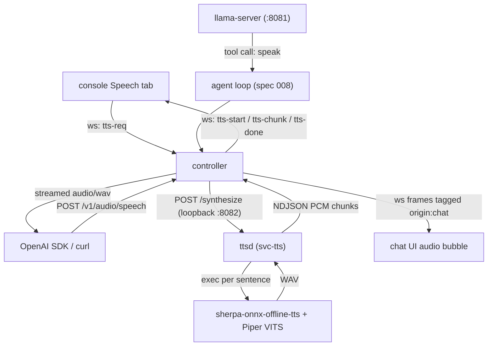

# Spec 009: Local Text-to-Speech (sherpa-onnx + Piper)

| | |
|---|---|
| Status | Executed (2026-07-23) |
| Depends on | `specs/002-container.md` (layers, s6), `specs/003-controller.md` (websocket hub, SPA), `specs/005-console-ui.md` (multi-page console, frame conventions), `specs/007-persistence-locality.md` (locality gate; no new persistent state), `specs/008-browser-agent.md` (agent tool registry) executed |
| Produces | A supervised local TTS engine (sherpa-onnx offline TTS + pinned Piper VITS voice) in new docker layers 013–014; an in-repo `ttsd` streaming daemon (`svc-tts`); websocket TTS frames; a console **Speech** tab with streaming in-browser playback; an OpenAI-compatible `POST /v1/audio/speech` endpoint; a `speak` agent tool with chat-side audio playback |
| Followed by | `specs/010-outbound-mail.md`, `specs/011-ui-refresh.md` |

## 0. Executor instructions

- The constitution (`specs/001-constitution.md` §1) binds this spec. `controller/go.mod` must still have **zero `require` lines**: `ttsd`, the controller TTS client, WAV parsing/writing, base64 chunking, and sentence splitting are stdlib-only. The synthesis engine itself is a pinned prebuilt binary (`sherpa-onnx-offline-tts`) exec'd as a subprocess — never linked (no cgo).
- New capabilities are added as **new higher-numbered docker layers** (constitution rule 6): layers `013` and `014` are appended after `012-manifest.sh`; existing layers 001–012 are not edited. The model is installed the same way as Gemma (spec 002 §3 / layer 003): exact URL + sha256, `chmod 0444`, baked into the image.
- All pins in §2 were fetched and hashed against live sources on **2026-07-23**. **Re-verify each sha256 before build** (`curl -fsSL <url> | sha256sum`); STOP on mismatch.
- No new persistent state: TTS is stateless (spec 007 §1 table unchanged; `$VM_DATA_DIR` gains nothing; scratch WAVs live in `/tmp`). The locality gate (`scripts/check-llm-local.sh`) must stay green: `ttsd` binds `127.0.0.1` only and the controller reaches it only via loopback.
- Trust model unchanged (constitution rule 8): no auth on `/v1/audio/speech`; anyone who can reach port 8080 can synthesize speech. Do not add auth speculatively.
- The Piper voice is **English, single voice** (`en_US-lessac-medium`, chosen for Raspberry Pi 4-class real-time synthesis). Multi-voice (e.g. Kokoro) is out of scope — a future spec; every API surface in this spec carries a `voice` field so that spec is additive.
- Stop-on-red per section; finish with the Acceptance Checklist (§10).

## 1. What it is

A fully local speech-synthesis pipeline: a supervised daemon (`svc-tts`) wraps the pinned `sherpa-onnx-offline-tts` CLI, splits input text into sentences, synthesizes each sentence, and streams PCM out as it is produced. Three consumers: the console **Speech** tab (websocket, plays audio while later sentences are still synthesizing), any OpenAI SDK (`POST /v1/audio/speech`), and the browser agent (a `speak` tool whose audio plays in the chat UI).



Latency expectation (documented, not a bug): Piper *medium* voices synthesize faster than real time on a Raspberry Pi 4 and several times faster on x64; sentence-level chunking means first audio is heard after one sentence, not after the whole text.

## 2. Docker layers 013–014 (engine + model, Gemma-style pins)

### 2a. `docker/layers/013-sherpa-onnx.sh` — pinned runtime

```bash
#!/usr/bin/env bash
# Layer 013: sherpa-onnx prebuilt CPU runtime (offline TTS CLI), pinned release.
set -euo pipefail
export DEBIAN_FRONTEND=noninteractive

SHERPA_TAG="v1.13.4"
case "$(uname -m)" in
  x86_64)
    ASSET="sherpa-onnx-${SHERPA_TAG}-linux-x64-shared.tar.bz2"
    SHA256="18887dc13c7d313d0e0f6c164ed31715c27c1c2c4f71acd7c0147dc84cf02514"
    ;;
  aarch64)
    ASSET="sherpa-onnx-${SHERPA_TAG}-linux-aarch64-shared-cpu.tar.bz2"
    SHA256="36c5a3c942358ed635471488f50a28a96181331c935b0dce75a02b7f49913dc2"
    ;;
  *) echo "unsupported arch: $(uname -m)" >&2; exit 1 ;;
esac

apt-get update
apt-get install -y --no-install-recommends bzip2
rm -rf /var/lib/apt/lists/*

cd /tmp
curl -fsSL --retry 3 -o "$ASSET" \
  "https://github.com/k2-fsa/sherpa-onnx/releases/download/${SHERPA_TAG}/${ASSET}"
echo "${SHA256}  ${ASSET}" | sha256sum -c -
mkdir -p /opt/sherpa-onnx
tar -xjf "$ASSET" --strip-components=1 -C /opt/sherpa-onnx
rm -f "$ASSET"

# Keep only what the TTS path needs: the offline-tts CLI and shared libs.
find /opt/sherpa-onnx/bin -maxdepth 1 -type f ! -name 'sherpa-onnx-offline-tts' -delete

# Sanity gate: binary must resolve all shared libraries on this libc/arch.
ldd /opt/sherpa-onnx/bin/sherpa-onnx-offline-tts | { ! grep 'not found'; }
```

### 2b. `docker/layers/014-tts-model.sh` — pinned Piper voice (same pattern as layer 003)

```bash
#!/usr/bin/env bash
# Layer 014: Piper VITS en_US lessac (medium) voice for sherpa-onnx, baked in.
# Raspberry Pi 4-capable (faster than real time); ~64 MB with espeak-ng data.
set -euo pipefail

MODEL_URL="https://github.com/k2-fsa/sherpa-onnx/releases/download/tts-models/vits-piper-en_US-lessac-medium.tar.bz2"
MODEL_SHA256="9e3febfacf0abf4270172d2958bcec246032b7e88efc2720840cc80c93de334e"
MODEL_DIR="/opt/models/tts"

mkdir -p "$MODEL_DIR"
cd /tmp
curl -fSL --retry 3 -o voice.tar.bz2 "$MODEL_URL"
echo "${MODEL_SHA256}  voice.tar.bz2" | sha256sum -c -
tar -xjf voice.tar.bz2 -C "$MODEL_DIR"
rm -f voice.tar.bz2
find "$MODEL_DIR" -type f -exec chmod 0444 {} +
test -f "$MODEL_DIR/vits-piper-en_US-lessac-medium/en_US-lessac-medium.onnx"
test -f "$MODEL_DIR/vits-piper-en_US-lessac-medium/tokens.txt"
test -d "$MODEL_DIR/vits-piper-en_US-lessac-medium/espeak-ng-data"
```

The bundle contents were verified on 2026-07-23: `en_US-lessac-medium.onnx`, `en_US-lessac-medium.onnx.json`, `tokens.txt`, `espeak-ng-data/`, `MODEL_CARD` (license: the voice model card in the bundle; Piper voices are MIT/blanket-permissive — record the MODEL_CARD text in the commit message if it differs).

### 2c. `docker/Dockerfile` additions (append-only)

- After the layer-012 `COPY`/`RUN` pair, append the matching pairs for `013-sherpa-onnx.sh` and `014-tts-model.sh`.
- Build `ttsd` in the existing `controller-build` stage (same flags as the controller) and copy it in the fast-moving top section:

```dockerfile
RUN cd controller && CGO_ENABLED=0 go build -trimpath -ldflags="-s -w" -o /out/ttsd ./cmd/ttsd
COPY --from=controller-build /out/ttsd /usr/local/bin/ttsd
```

- `ENV` block additions:

```
VM_TTS_PORT=8082
VM_SHERPA_DIR=/opt/sherpa-onnx
VM_TTS_MODEL_DIR=/opt/models/tts/vits-piper-en_US-lessac-medium
VM_TTS_VOICE=en_US-lessac-medium
VM_TTS_MAX_CHARS=4096
```

## 3. `ttsd` — the supervised streaming daemon

New stdlib-only command `controller/cmd/ttsd` plus package `controller/internal/tts` (shared by ttsd and the controller client).

- **Bind**: `127.0.0.1:$VM_TTS_PORT` only (locality).
- **`GET /healthz`** → `200 {"ok":true,"voice":"en_US-lessac-medium"}` after checking the model files in `$VM_TTS_MODEL_DIR` exist; `503` otherwise.
- **`POST /synthesize`** — body `{"text":string, "speed":number, "split":bool}`:
  - `text` required, ≤ `$VM_TTS_MAX_CHARS` (reject with 400 above the cap); `speed` clamped to `[0.5, 2.0]`, default `1.0`; `split` default `true`.
  - Response is a **chunked NDJSON stream** (`Content-Type: application/x-ndjson`), one JSON object per line:
    - `{"type":"start","sampleRate":22050,"channels":1,"sentences":N}` — sample rate read from the first generated WAV header, never hardcoded.
    - `{"type":"chunk","seq":i,"sentence":"…","pcm":"<base64 s16le mono>","genMs":int}` per sentence, emitted as soon as that sentence's synthesis finishes.
    - `{"type":"done","audioSec":float,"rtf":float}` (`rtf` = wall synthesis time / audio duration) or `{"type":"error","error":"…"}`.
  - Client disconnect / request-context cancellation aborts the in-flight `sherpa-onnx-offline-tts` process (process-group kill) and stops the stream.
- **Sentence splitting** (`internal/tts.SplitSentences`): split on `.` `!` `?` `…` followed by whitespace/EOL, and on blank lines; merge fragments shorter than 20 chars into the following sentence; hard-split any sentence over 300 chars at the nearest preceding whitespace. `split:false` treats the whole text as one sentence (still subject to the hard cap).
- **Per-sentence synthesis**: exec
  `$VM_SHERPA_DIR/bin/sherpa-onnx-offline-tts --vits-model=$VM_TTS_MODEL_DIR/en_US-lessac-medium.onnx --vits-tokens=$VM_TTS_MODEL_DIR/tokens.txt --vits-data-dir=$VM_TTS_MODEL_DIR/espeak-ng-data --vits-length-scale=<1/speed> --output-filename=<tmpfile.wav> "<sentence>"`
  with `LD_LIBRARY_PATH=$VM_SHERPA_DIR/lib`. Parse the output WAV (proper RIFF chunk walk in stdlib, not a fixed 44-byte skip), extract the s16le mono PCM payload, delete the tmpfile.
- **Serialization**: one synthesis at a time (mutex; CPU-bound engine); concurrent `POST /synthesize` requests queue FIFO and honor cancellation while queued.
- **Testability**: the CLI invocation goes through an injected `Runner` interface (same pattern as spec 008 tools), so unit tests assert argv and feed fixture WAVs without the binary.

### 3a. `svc-tts` (s6 longrun)

New service directory `docker/rootfs/etc/s6-overlay/s6-rc.d/svc-tts/`: `type` = `longrun`, `dependencies.d/base`, and membership `user/contents.d/svc-tts`. `run`:

```bash
#!/command/with-contenv bash
exec /usr/local/bin/ttsd
```

(`ttsd` reads all `VM_TTS_*`/`VM_SHERPA_DIR` config from env.)

## 4. Controller wiring

### 4a. Health probe

`health.Config` gains `TTSHealthURL` (default `http://127.0.0.1:` + `VM_TTS_PORT` + `/healthz`, env override `VM_TTS_HEALTH_URL`); `Gather` gains a seventh probe `{name:"tts"}` via the existing `checkHTTP`. Update the `main.go` startup log line ("six concurrent probes" → "seven"). The Status page service list picks it up with no SPA change.

### 4b. Websocket frames (extends the spec 005 §12 frame family; no collisions)

Client → server:

| Frame | Payload | Effect |
|---|---|---|
| `tts-req` | `{id, text, speed?}` | start a synthesis stream for **this connection** |
| `tts-stop` | `{id}` | cancel that stream |

Server → client (sent to the requesting connection only, like `metrics`; the `speak` tool instead **broadcasts** with `origin:"chat"`, §6):

| Frame | Payload |
|---|---|
| `tts-start` | `{id, origin:"console"\|"chat", sampleRate, channels, sentences}` |
| `tts-chunk` | `{id, origin, seq, pcm}` (base64 s16le) |
| `tts-status` | `{id, origin, phase:"queued"\|"synthesizing"\|"done"\|"stopped"\|"failed", sentence, sentences, rtf}` |
| `tts-done` | `{id, origin, audioSec, rtf}` |
| `tts-error` | `{id, origin, error}` |

The controller's `internal/tts.Client` POSTs to ttsd, converts the NDJSON stream into these frames, and enforces one active console stream per connection (a second `tts-req` cancels the first). Base64-in-JSON overhead (~33%) is accepted to keep the single text-frame websocket protocol (spec 003) untouched.

### 4c. OpenAI-compatible endpoint

`newMux` gains `POST /v1/audio/speech` (any other method → 405). Request body per the OpenAI Audio API: `{"model":string, "input":string, "voice":string, "response_format":string, "speed":number}`.

- `model` and `voice` are accepted and ignored (single baked voice; echoed back in an `X-VM-Voice: en_US-lessac-medium` response header). `input` maps to `text`, `speed` passes through.
- `response_format`: `"wav"` (default) streams `audio/wav` — RIFF/`data` chunk sizes written as `0xFFFFFFFF` (streaming-WAV convention, players read to EOF) with PCM flushed per sentence chunk; `"pcm"` streams raw s16le with `X-VM-Sample-Rate: 22050`; any other value → 400 (mp3/opus transcoding is out of scope — no encoder in the image).
- Errors: OpenAI-style JSON `{"error":{"message":…,"type":"invalid_request_error"}}` for 4xx; 502 if ttsd is unreachable.
- `/v1/audio/speech` must be added to the `spaHandler` passthrough-exclusion prefixes alongside `/healthz`, `/ws`, `/desktop/`.

## 5. Console Speech tab

- **Route**: `["/speech", ["speech", "Speech"]]` in `router.js`; sidebar link with a `volume-2` icon; new `<section data-page="speech" hidden>` in `index.html`.
- **Icons**: add `volume-2`, `play`, `pause` to the `ICONS` list in `controller/tools/fetch-assets.sh` (all exist in the pinned Lucide 1.26.0 zip; the sprite build picks them up automatically).
- **New module** `controller/web/static/js/tts.js` (initialized from `app.js`):
  - Textarea (`maxlength` = 4096, live character count like chat), speed slider `0.5–2.0` (step `0.1`, default `1.0`, value label), voice shown as a static "Lessac (en-US)" label (single voice), **Speak** and **Stop** buttons.
  - **Streaming playback** via Web Audio: on `tts-start` create/resume an `AudioContext`; each `tts-chunk` is base64-decoded, converted s16le → Float32, wrapped in an `AudioBuffer`, and scheduled with an `AudioBufferSourceNode` at a rolling `startTime` (max of `context.currentTime` and the previous chunk's end) so sentences play gaplessly while later ones are still synthesizing.
  - **Rich status line** (same visual slot pattern as `llm-status`): `sending → synthesizing sentence i/n → playing (x.xx× real time) → done (N.N s audio)`; `stopped`/error states; disable Speak while a stream is active.
  - Stop sends `tts-stop`, halts scheduled sources, and resets state.

## 6. `speak` agent tool + chat playback

- **Tool definition** (added to `Definitions()` in `controller/internal/agent/tools.go`): name `speak`, description "Speak text aloud to the user through the console (local text-to-speech). Use when the user asks to hear something or an audible response is clearly better.", parameters `{text: string (required, ≤ 4096 chars), speed?: number 0.5–2.0}`.
- **Execution** (new case in `Execute()`): calls the shared `internal/tts.Client`; frames are **broadcast to all connections** with `origin:"chat"` and `id` = the agent task/step id. The tool result returned to the model is `{"ok":true,"audioSec":N.N}` (or the error). Synthesis is awaited (the agent step ends when audio generation ends; playback continues client-side).
- **Chat UI** (`chat.js`): on `tts-start` with `origin:"chat"`, append an **audio bubble** to the chat log: speaker icon, live progress text ("speaking · sentence i/n"), and a replay button. Chunks are buffered in memory for the session so replay works; audio is **not persisted** (the durable transcript records the tool call — the agent-step timeline from spec 005 §12 already shows `speak` like any tool). Playback uses the same Web Audio scheduler as §5 (factor it into a small shared module, e.g. `static/js/audio-player.js`, used by both `tts.js` and `chat.js`).
- **System prompt**: the agent system prompt (spec 008 §4) gains one line advertising `speak` and when to use it (explicit user request to hear something; otherwise answer in text). This is how "the LLM responds with a TTS response" happens: the model calls `speak`, the chat interface plays it.
- **Stop**: the existing chat stop (spec 005 §2) cancels the agent context, which cancels an in-flight `speak` synthesis like any tool.

## 7. Locality and persistence posture

- `scripts/check-llm-local.sh` stays green: the only new endpoint is `http://127.0.0.1:8082` (loopback). Add `VM_TTS` to the gate's recognized loopback-default env prefixes **only if** the gate flags it (the current pattern set keys on LLM surfaces and should not match `/synthesize`; do not weaken the gate otherwise).
- No spec 007 §1a table change: ttsd writes only `/tmp` scratch WAVs (deleted per sentence; tmpfs). The smoke known-set is unchanged.

## 8. Tests

- **Go, hermetic** (`internal/tts`, `cmd/ttsd`, controller):
  - `SplitSentences`: abbreviations-free basic cases, merge-short-fragments, 300-char hard split, `split:false`.
  - WAV chunk-walk parser over fixture files (standard 44-byte header and one with an extra `LIST` chunk).
  - ttsd handler with a fake `Runner`: asserts argv (model/tokens/data-dir paths, `--vits-length-scale` = 1/speed), NDJSON ordering (`start` → `chunk`* → `done`), speed clamping, char-cap 400, cancellation kills the runner context.
  - Controller client + ws frames against an `httptest` fake ttsd: frame sequence, per-connection delivery for console requests, broadcast for `origin:"chat"`, second `tts-req` cancels the first.
  - `/v1/audio/speech`: wav mode emits a valid streaming RIFF header + PCM passthrough; pcm mode raw; bad `response_format` → 400; ttsd down → 502.
  - `speak` tool: schema present, `Execute` dispatches, result JSON shape.
- **e2e** (`test/e2e.sh` + new `test/tts-probe.mjs`): over the real container: (1) ws `tts-req` with "Hello from Virtual Me. This is a test." → assert `tts-start` (sampleRate > 0, sentences = 2), ≥ 2 ordered `tts-chunk`s whose decoded PCM is non-silent (RMS above a floor), then `tts-done`; (2) `POST /v1/audio/speech` → `200`, `Content-Type: audio/wav`, body starts with `RIFF`, length > 10 KB; (3) `tts-stop` mid-stream terminates frames for that id.
- **Smoke** (`test/smoke.sh`): `/healthz` report includes `{"name":"tts","ok":true}`.
- **Agent e2e** (behind `E2E_AGENT=1`, spec 008 §10 pattern): chat "say hello out loud" → expect an `agent-step` with tool `speak` and broadcast `tts-*` frames with `origin:"chat"`.

## 9. Docs refresh (constitution rule 9)

Run the `/master-update` skill procedure. Expected changes: README gains a "Speech" feature bullet + `POST /v1/audio/speech` API note; `operate` skill: Speech tab usage, single-voice note, latency expectation; `develop` skill: layers 013–014, `svc-tts`, `cmd/ttsd`, `internal/tts`, the `speak` tool, ws `tts-*` frames; `AGENTS.md` layout/architecture rows mention the TTS engine.

## 10. Acceptance checklist (run every item)

| # | Command / action | Expected |
|---|---|---|
| 1 | `cat controller/go.mod` | still no `require` lines |
| 2 | Re-verify §2 sha256 pins (both arch tarballs + voice bundle) | match; STOP on mismatch |
| 3 | `npm run check` | `check: OK`; `locality: OK` |
| 4 | `cd controller && go test ./... -count=1` | §8 Go tests pass |
| 5 | `docker build -f docker/Dockerfile -t virtualme:dev .` | succeeds; layers 013 (sherpa-onnx) and 014 (voice, ~64 MB) present in `docker history` |
| 6 | `docker run --rm virtualme:dev sh -c 'ldd /opt/sherpa-onnx/bin/sherpa-onnx-offline-tts | grep -c "not found"'` | `0` |
| 7 | Running container: `curl -fsS http://127.0.0.1:8080/healthz` | includes `"name":"tts","ok":true` |
| 8 | `curl -fsS -X POST localhost:8080/v1/audio/speech -d '{"input":"Hello there."}' -o out.wav && file out.wav` | RIFF WAVE audio, playable |
| 9 | `bash test/e2e.sh` | `e2e: OK` incl. tts probe |
| 10 | Manual: Speech tab, paste a paragraph, Speak | audio starts after the first sentence, status advances i/n, Stop halts immediately |
| 11 | Manual: chat "please say hello out loud" | model calls `speak`; audio bubble appears in chat and plays; replay works |
| 12 | `docker exec virtualme sh -c 'grep -c ":1F92 " /proc/net/tcp'` and same grep with local address `0100007F:1F92` | ttsd listener exists and is bound to `127.0.0.1` (`0100007F`) only (`1F92` = 8082 hex); no `00000000:1F92` entry |
| 13 | `/master-update` run | §9 docs updated |

Commit as `spec 009: local TTS (sherpa-onnx + Piper) — engine, console tab, OpenAI speech API, speak tool`.

## Amendments

### 2026-07-23 — s6 user-bundle membership

The repository's s6-overlay version defines the user bundle under
`docker/rootfs/etc/s6-overlay/user-bundles.d/user/`. Accordingly, `svc-tts`
membership is installed at `user-bundles.d/user/contents.d/svc-tts`, not the
deprecated runtime-generated `s6-rc.d/user/contents.d/` path shown in §3a.
Creating the latter in the image prevents unprivileged s6 startup.
