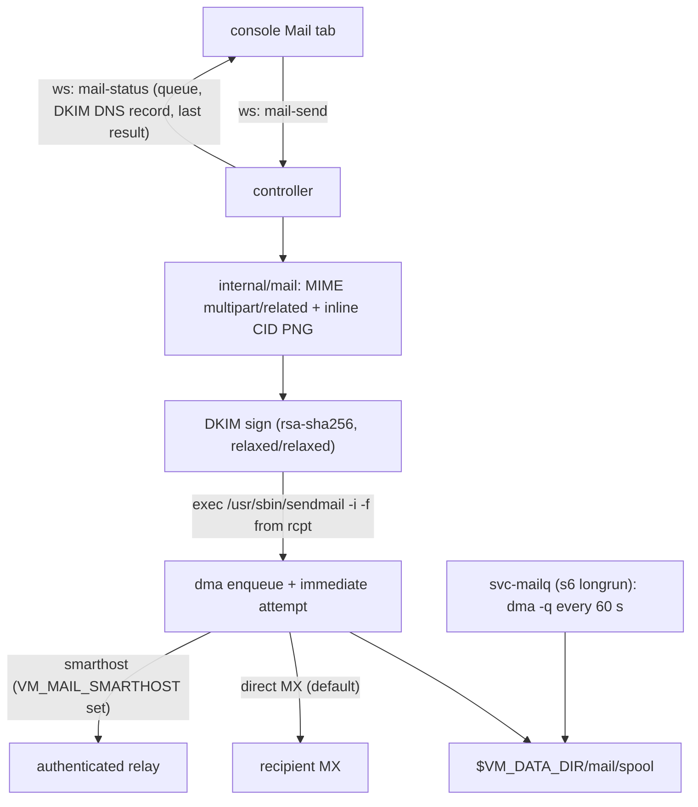

# Spec 010: Outbound Mail — Supervised MTA + Console Mail Tab

| | |
|---|---|
| Status | Executed (2026-07-23) |
| Depends on | `specs/002-container.md` (layers, s6, unprivileged uid), `specs/003-controller.md` (websocket hub, SPA), `specs/005-console-ui.md` (multi-page console), `specs/007-persistence-locality.md` (persistence map + smoke known-set, superseded per §7) executed; `specs/009-local-tts.md` only for layer numbering (this spec appends layer 015 after 013–014) |
| Produces | A packaged MTA (`dma`, DragonFly Mail Agent) in new docker layer 015 with a supervised queue-runner service (`svc-mailq`); a controller `internal/mail` package (Gmail-compatible MIME with inline CID images + DKIM signing, stdlib-only); websocket mail frames; a console **Mail** tab for sending test messages with embedded images; `$VM_DATA_DIR/mail/` persistence |
| Followed by | `specs/011-ui-refresh.md` |

## 0. Executor instructions

- The constitution (`specs/001-constitution.md` §1) binds this spec. `controller/go.mod` must still have **zero `require` lines**: MIME composition (`mime/multipart`, `mime/quotedprintable`), DKIM signing (`crypto/rsa`, `crypto/sha256`, `encoding/base64`), PNG test-image generation (`image/png`), and queue inspection are all stdlib.
- **MTA choice (grounded deviation, decided 2026-07-23):** the container runs fully unprivileged (spec 002: `USER virtualme`, uid/gid 1000, s6 as non-root). OpenSMTPD, Postfix, Exim, and Sendmail all require root at startup for privilege separation and are therefore **infeasible here**. The packaged MTA is **`dma`** (DragonFly Mail Agent, Debian trixie `dma 0.13-1`): a small MTA designed for exactly this role — accepts mail via its `sendmail(8)` interface, delivers **directly to remote MX hosts** by default, supports an authenticated smarthost with TLS/STARTTLS, and keeps a retry queue. It has **no SMTP listener by design** (nothing new is network-exposed) and no DKIM support — DKIM signing is done in the controller (§4b). The supervised "mail daemon" process is the `svc-mailq` queue runner (§3).
- New capability = new higher-numbered layer (constitution rule 6): layer `015` is appended; layers 001–014 are not edited.
- The `dma` artifact is pinned by the apt pipeline of the base image (same posture as Chromium/Valkey layers 005/006): Debian stable's package, not a URL pin. Record the installed version in the layer's build log assertion (§2).
- **Deliverability honesty (document, do not oversell):** direct-to-Gmail delivery from residential/dynamic IPs is usually rejected regardless of message quality; Gmail requires at least SPF or DKIM alignment plus acceptable IP reputation/PTR. This spec ships correct DKIM signatures and correct MIME so the *message* is never the problem, and provides the smarthost path as the reliable fallback. The Mail tab surfaces this guidance (§5).
- This spec **supersedes** (constitution rule 4, superseding text lives here; no existing spec file is edited):
  - spec 007 §1a persistence table — adds the `$VM_DATA_DIR/mail/` row (§7);
  - spec 007 §2c / smoke known-set — the top-level allowlist gains `mail` (§7).
- Trust model unchanged (constitution rule 8): anyone who can reach port 8080 can send mail from this host. Acceptable for the private-network prototype; do not add auth speculatively.
- Stop-on-red per section; finish with the Acceptance Checklist (§9).

## 1. What it is



Delivery mode is chosen by configuration: **direct MX** when no smarthost is configured (dma resolves the recipient domain's MX and speaks SMTP to it), **smarthost relay** when `VM_MAIL_SMARTHOST` is set (STARTTLS + AUTH when credentials are provided).

## 2. Docker layer 015 + baked filesystem

### 2a. `docker/layers/015-mta.sh`

```bash
#!/usr/bin/env bash
# Layer 015: dma (DragonFly Mail Agent) — unprivileged-friendly outbound MTA.
# Direct-MX delivery by default; optional smarthost; queue with retries.
# Chosen over OpenSMTPD/Postfix/Exim, which require root (container is uid 1000).
set -euo pipefail
export DEBIAN_FRONTEND=noninteractive

# Preseed debconf so the package installs non-interactively with no smarthost.
debconf-set-selections <<'EOF'
dma dma/mailname string virtualme.local
dma dma/relayhost string
EOF

apt-get update
apt-get install -y --no-install-recommends dma
rm -rf /var/lib/apt/lists/*
dpkg -s dma | grep '^Version:'   # record the pinned-by-distro version in the build log

# The runtime uid (1000, created in layer 009) owns the mail path end to end:
# no setgid games, no cron (s6 supervises the queue runner instead).
chmod 0755 /usr/sbin/dma
rm -f /etc/cron.d/dma

# Config + spool live on the persistent data mount; bake symlinks to them.
# (Dangling at build time; cont-init creates the targets at boot, spec 002 §5.)
rm -f /etc/dma/dma.conf /etc/dma/auth.conf
ln -s /home/virtualme/.virtualme/mail/dma.conf /etc/dma/dma.conf
ln -s /home/virtualme/.virtualme/mail/auth.conf /etc/dma/auth.conf
rm -rf /var/spool/dma
ln -s /home/virtualme/.virtualme/mail/spool /var/spool/dma
```

### 2b. Dockerfile + env

Append the `COPY`/`RUN` pair for `015-mta.sh` after layer 014. `ENV` block additions (all optional-with-defaults; only `VM_MAIL_SMARTHOST*` and `VM_MAIL_DKIM_*` change behavior when set at `docker run` time):

```
VM_MAIL_FLUSH_SEC=60
```

Runtime-only env (documented in README/operate skill, no baked default): `VM_MAIL_MAILNAME` (HELO + default From domain; defaults to the container hostname), `VM_MAIL_FROM` (default `virtualme@<mailname>`), `VM_MAIL_SMARTHOST`, `VM_MAIL_SMARTHOST_PORT` (default 587), `VM_MAIL_SMARTHOST_USER`, `VM_MAIL_SMARTHOST_PASS`, `VM_MAIL_DKIM_DOMAIN`, `VM_MAIL_DKIM_SELECTOR` (default `virtualme`).

### 2c. Config generation — `docker/rootfs/etc/cont-init.d/20-mail-config.sh`

New cont-init script (runs as the runtime uid, after `10-data-dirs.sh`):

- `mkdir -p "$VM_DATA_DIR/mail/spool"`.
- Render `$VM_DATA_DIR/mail/dma.conf` from env:
  - always: `MAILNAME <VM_MAIL_MAILNAME or $(hostname)>`;
  - smarthost mode (`VM_MAIL_SMARTHOST` set): `SMARTHOST <host>`, `PORT <VM_MAIL_SMARTHOST_PORT>`, `STARTTLS`, `SECURETRANSFER`, and `AUTHPATH /etc/dma/auth.conf` when credentials are set;
  - direct mode (default): none of the above (dma then does MX delivery).
- Render `$VM_DATA_DIR/mail/auth.conf` (`user|smarthost:password`, mode 0600) when credentials are set; remove it otherwise.

The DKIM key is **not** generated here (no openssl dependency): the controller generates it (§4b).

## 3. `svc-mailq` — the supervised mail daemon

`docker/rootfs/etc/s6-overlay/s6-rc.d/svc-mailq/`: `type` = `longrun`, `dependencies.d/base`, membership `user/contents.d/svc-mailq`. `run`:

```bash
#!/command/with-contenv bash
# Queue runner: dma attempts delivery immediately on enqueue; this loop
# retries deferred mail (temporary MX failures, greylisting) forever.
set -euo pipefail
while :; do
  /usr/sbin/dma -q || true
  sleep "${VM_MAIL_FLUSH_SEC:-60}"
done
```

## 4. Controller: `internal/mail`

### 4a. Gmail-compatible MIME composition

`Compose(msg Message) ([]byte, error)` where `Message{From, To []string, Subject, TextBody, HTMLBody string, Inline []InlinePart}` and `InlinePart{CID, MIMEType string, Data []byte}`. Structure (the canonical shape Gmail renders with inline images loading, no "show images" placeholder for CID parts):

```
multipart/related; type="multipart/alternative"
├── multipart/alternative
│   ├── text/plain; charset=utf-8            (quoted-printable)
│   └── text/html; charset=utf-8             (quoted-printable, )
├── image/png; Content-ID: <img1@virtualme>  (base64, Content-Disposition: inline; filename=...)
└── ...
```

Rules: `From`/`To`/`Subject` (RFC 2047-encoded when non-ASCII), `Date` (RFC 5322), `Message-ID` (`<unix-nano.rand@mailname>`), `MIME-Version: 1.0`; CRLF line endings throughout; base64 wrapped at 76 columns; Content-ID values in angle brackets and referenced in HTML as `cid:` **without** brackets; deterministic boundaries and Message-ID via injected time/rand sources so golden-file tests are byte-exact.

### 4b. DKIM signing (stdlib)

- **Keygen**: on controller startup, if `VM_MAIL_DKIM_DOMAIN` is set and `$VM_DATA_DIR/mail/dkim.key` is missing, generate a 2048-bit RSA key (PKCS#1 PEM, mode 0600). Derive the DNS TXT record (`<selector>._domainkey.<domain>` → `v=DKIM1; k=rsa; p=<base64 pubkey>`) and expose it in `mail-status` (§5) so the user can publish it.
- **Sign(message, domain, selector, key)**: RFC 6376, `a=rsa-sha256`, `c=relaxed/relaxed`, `h=from:to:subject:date:message-id:mime-version:content-type`, body hash over the CRLF-canonicalized full body; prepends the `DKIM-Signature` header. Applied to every outbound message when DKIM is configured; skipped (with a `mail-status` note) otherwise. dma prepends only trace headers on delivery, which are unsigned, so the signature survives.
- Without DKIM the direct path can still pass at Gmail via SPF alone if the user publishes an SPF record covering the sending IP — stated in the Mail tab guidance, not assumed.

### 4c. Submission and queue inspection

- **Send**: pipe the composed (signed) message to `/usr/sbin/sendmail -i -f <envelope-from> <rcpt>...` via an injected `Runner` (spec 008 pattern). Exit 0 = enqueued (delivery is asynchronous); nonzero = submission error surfaced to the UI.
- **Queue**: list `$VM_DATA_DIR/mail/spool` directly (each queued message is a spool file pair): return `{id, size, ageSec}` entries. Empty spool = empty queue. (Reading the spool beats shelling to `mailq` and is trivially testable against a fixture dir.)
- **Test image**: `TestImage() ([]byte, error)` renders a deterministic 320×180 PNG in Go (`image/png`): themed two-tone gradient with a plotted sine curve — no fonts, no assets, byte-stable for tests.

## 5. Websocket frames + console Mail tab

Client → server:

| Frame | Payload | Effect |
|---|---|---|
| `mail-send` | `{id, to, subject, body, includeTestImage}` | compose (§4a; `body` text → paragraphs for the HTML part), sign, submit |
| `mail-status-req` | `{}` | reply with current mail status |

Server → client (`mail-result` to the requesting connection; `mail-status` broadcast on change and sent on request):

| Frame | Payload |
|---|---|
| `mail-result` | `{id, ok, error?}` |
| `mail-status` | `{mode:"direct"\|"smarthost", from, mailname, dkim:{enabled, domain, selector, dnsName, dnsValue}, queue:[{id,size,ageSec}], lastResult:{ts, to, ok, error?}}` |

**Mail tab**: route `["/mail", ["mail", "Mail"]]` in `router.js`; sidebar link with a `mail` icon (add `mail` to the `ICONS` list in `controller/tools/fetch-assets.sh`); new `<section data-page="mail" hidden>`; new module `controller/web/static/js/mail.js`:

- Compose form: To (required, basic address validation), Subject, Body (textarea), "Embed test image" checkbox; Send button disabled while a send is in flight; result banner from `mail-result`.
- **"Send Gmail test"** button: one click pre-fills subject "Virtual Me test message", a short body, checks the embed box, and sends — the recipient should see the inline image rendered by Gmail (acceptance §9 item 10).
- Status panel from `mail-status`: delivery mode, From identity, DKIM state with the copyable DNS TXT record (name + value), live queue table, last send result.
- Deliverability guidance block (static text): direct MX needs SPF and/or DKIM plus decent IP/PTR reputation; residential IPs should use the smarthost env vars; links nowhere (SPA stays same-origin, spec 007 §2b — plain text only).

## 6. Health probe

`health.Config` gains `SendmailPath` (default `/usr/sbin/sendmail`) and `MailSpoolDir` (default `$VM_DATA_DIR/mail/spool`); `Gather` gains a probe `{name:"mail"}` that checks the sendmail binary is executable and the spool directory is writable (filesystem probe — there is no port, by design). Update the probe-count log line in `main.go`.

## 7. Persistence + gate updates (supersedes spec 007 lists)

New persistent row (spec 007 §1a table semantics):

| State | Path | Owner / mechanism | Introduced |
|---|---|---|---|
| Mail spool, MTA config, DKIM key | `$VM_DATA_DIR/mail/` (`spool/`, `dma.conf`, `auth.conf`, `dkim.key`) | `20-mail-config.sh`, controller keygen, dma spool symlink | 010 |

Required edits (code/lists, not spec files):

- `docker/rootfs/etc/cont-init.d/10-data-dirs.sh`: add `"$VM_DATA_DIR/mail/spool"` to the `mkdir -p` list (parent `mail/` is implied).
- `scripts/check-llm-local.sh` persistence literal list: add `mail`.
- `test/smoke.sh` top-level allowlist case: `valkey|chromium|xdg|metrics|agent|mail`.
- Locality: outbound SMTP (ports 25/587 to the internet) is deliberate egress and is **not** an LLM surface; the locality gate's patterns must remain untouched and green. No `internal/mail` line may mention an LLM surface or provider host.

## 8. Tests

- **Go, hermetic** (`internal/mail`):
  - Golden-file MIME tests with injected clock/rand: full multipart/related structure, alternative ordering (plain before html), CID header shape (`<img1@...>` header vs `cid:img1@...` reference), quoted-printable and 76-col base64, CRLF endings.
  - DKIM: sign a fixture message, then verify in-test with `rsa.VerifyPKCS1v15` over independently recomputed relaxed/relaxed header/body hashes; tamper the body → verification fails. Keygen writes 0600 and is idempotent; TXT record shape.
  - Submission: `Runner` argv is `sendmail -i -f <from> <rcpt>...` with the message on stdin; nonzero exit surfaces the error.
  - Queue listing over a fixture spool dir; `TestImage()` is a valid, byte-stable PNG.
  - Frame handling: `mail-send` → compose/sign/submit path with fakes; `mail-status` shape.
- **e2e** (`test/e2e.sh` + new `test/mail-probe.mjs` + new `test/mail-sink.mjs`):
  - `mail-sink.mjs`: minimal SMTP sink on `127.0.0.1:2525` (node `net` built-ins only — constitution-safe), speaks `220/250/354`, captures the DATA payload to a file.
  - `e2e.sh` starts the container with `--add-host=vmhost:host-gateway -e VM_MAIL_SMARTHOST=vmhost -e VM_MAIL_SMARTHOST_PORT=2525 -e VM_MAIL_DKIM_DOMAIN=example.test`, sends `mail-send` (test image on) via the websocket, then asserts the sink received a message containing `multipart/related`, a `Content-ID:` header, a `cid:` reference, and a `DKIM-Signature:` header; `mail-status` shows the DNS record and an empty queue after delivery.
  - Direct-mode assertion (no smarthost env): a send to `nobody@invalid.test` is accepted (enqueued) and appears in the `mail-status` queue — delivery failure/retry is dma's job and is not asserted against the real internet.
- **Smoke** (`test/smoke.sh`): `/healthz` includes `{"name":"mail","ok":true}`; `$DATA_DIR/mail/spool` exists; allowlist updated per §7.

## 9. Acceptance checklist (run every item)

| # | Command / action | Expected |
|---|---|---|
| 1 | `cat controller/go.mod` | still no `require` lines |
| 2 | `npm run check` | `check: OK`; `locality: OK` |
| 3 | `cd controller && go test ./... -count=1` | §8 Go tests pass (MIME goldens, DKIM round-trip, runner argv, queue, PNG) |
| 4 | `docker build -f docker/Dockerfile -t virtualme:dev .` | succeeds; layer 015 present; build log shows the dma `Version:` line |
| 5 | `docker run --rm virtualme:dev ls -l /etc/dma/ /var/spool/dma` | symlinks into `/home/virtualme/.virtualme/mail/` |
| 6 | Running container: `curl -fsS http://127.0.0.1:8080/healthz` | includes `"name":"mail","ok":true` |
| 7 | Running container: `docker exec virtualme pgrep -f 'dma -q' || docker exec virtualme s6-svstat /run/service/svc-mailq` | queue runner supervised and up |
| 8 | `bash test/smoke.sh` | `smoke: OK` incl. `mail` allowlist + spool assertions |
| 9 | `bash test/e2e.sh` | `e2e: OK` incl. sink-received message with `multipart/related` + `Content-ID` + `DKIM-Signature` |
| 10 | Manual: set a real smarthost env (or good direct-path DNS), Mail tab → "Send Gmail test" to a Gmail address | message arrives; the embedded image renders inline in Gmail |
| 11 | Manual: Mail tab with `VM_MAIL_DKIM_DOMAIN` set | DKIM DNS name/value shown and copyable; key file `dkim.key` is 0600 in `$VM_DATA_DIR/mail/` |
| 12 | Restart cycle (stop/start) | spool + DKIM key + conf survive under `$VM_DATA_DIR/mail/` |
| 13 | `/master-update` run | §10 docs updated |

## 10. Docs refresh (constitution rule 9)

Run the `/master-update` skill procedure. Expected changes: README — outbound-mail feature bullet, `VM_MAIL_*` env table, deliverability caveat (SPF/DKIM/PTR, smarthost recommendation); `operate` skill — configuring smarthost/DKIM, publishing the TXT record, reading the queue, "why is my mail not arriving" triage; `develop` skill — layer 015, `svc-mailq`, `internal/mail`, ws `mail-*` frames, spool layout; `AGENTS.md` — layout/architecture mention.

Commit as `spec 010: outbound mail — dma MTA, DKIM in controller, console Mail tab`.

## Amendments

### 2026-07-24 — Queue transparency supersession

Spec 023 supersedes §3's queue-runner body, §4c's size/age-only queue model,
and §5's corresponding `mail-status` shape. The runner now persists a bounded
delivery log and atomic last-flush marker; the controller defensively reads
dma envelope/message pairs and exposes queue metadata, next-flush timing, and
an in-memory lifecycle timeline.
